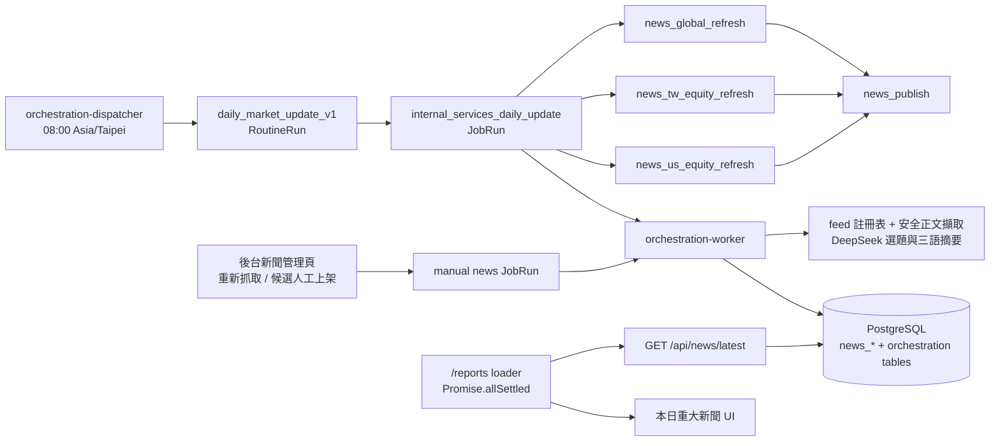

# 每日重大新聞（Daily news）

狀態：API、Provider Function／Job／Routine、資料表與客戶端 UI 已實作並有測試；
正式環境以 `DAILY_INSIGHTS_DAILY_NEWS_ENABLED` 旗標 gating，第一次部署時保持
關閉，經本地 `--once` 驗證後再啟用。實作與部署接線的細節見
[專案審查基準](../reviews/2026-09-02-project-review.md) 的 D-02、B-05 至 B-09。

本功能在路線圖既有階段之外交付，不影響 Podcast 試點與三市場晨報的驗收條件。
它使用 DeepSeek 作為選題與摘要模型，但不是 Phase 5 對話功能的一部分；模型設定
沿用相同的 `DAILY_INSIGHTS_MODEL_*` 變數。

## 範圍

- 每日為全球、台股與美股各產生一版重點新聞，附三語系標題與摘要；五星新聞不設發布上限、四星發布 5～10 則、一至三星合計至多 5 則。
- 只從白名單新聞來源擷取正文；候選一律來自各來源自己的 RSS、Atom、news sitemap
  或 JSON 清單（feed 註冊表是唯一的探索路徑，白名單也由註冊表推導）。文章正文不
  落地，只保存來源中繼資料、摘要與 SHA-256 內容摘要。
- 顯示在客戶報告首頁的清單下方；所有已驗證組織共用同一版，不受市場可見性政策
  影響。
- 後台「新聞管理」頁提供人工覆核：可看到每個版本探索到的全部候選與 AI 的處置結果，
  可隱藏 AI 選入但不相關的新聞，也可把 AI 未選的候選人工上架（見
  [後台候選監控與人工上架](#後台候選監控與人工上架)）。客戶端仍不提供篩選。

## 流程

執行順序：

1. 統一 dispatcher 於台北時間每日 08:00（含週末、假日）建立唯一的
   `daily_market_update_v1` RoutineRun。`internal_services_daily_update` 先執行全球、
   台股與美股三個 refresh functions；三者都取得 terminal 結果後才執行
   `news_publish`。Refresh 只準備候選與 workflow 成果，不負責發布。
2. Worker 依結構化失敗分類決定恢復，與新聞篇數、edition `partial` 狀態分離。
   暫時故障每 30 分鐘重試缺失 scopes，並遵守更長的 `Retry-After`。
   completion、ownership 驗證與下一筆 retry 寫入在同一交易完成。`next_attempt_at`
   未到不得 claim；10:00:00 起不再開始新的自動外部 attempt，已送出的單次請求可完成
   保存。Terminal-dependent function `news_publish` 不呼叫外部 provider，會在
   dependencies terminal
   後執行，即使跨過 soft deadline 也不讓 DAG 永久等待。市場／日期鎖、租約與
   checkpoint 支援重啟續跑：只重抓失敗 feed，重新
   取得必要原文，重用符合指紋的選題與已驗證摘要，不再以 edition 是否存在判斷可跳過。
   詳細分類、操作與限制見 [新聞恢復操作手冊](../runbooks/news-recovery.md)。
3. `discover_feed_candidates` 依序讀取標記給該市場、且文章主機在白名單內的 feed，
   只保留符合各來源 `link_pattern` 的連結，並以 URL 與標題去重；任一 feed 失敗只
   影響該來源，事件為 `news.feed.failed`。需要金鑰或聯絡信箱的來源在設定缺漏時發
   `news.feed.skipped` 並略過。標記 `language_filter` 的新聞稿 feed 以 `langdetect`
   丟棄中、英、日、韓以外的稿件。
4. 每個版本在正文擷取前，先以該市場 `EditionSpec.headline_impact_patterns` 定義的多組
   標題訊號調整送審優先序。全球版關注央行、總經、主權債、能源、地緣政治與主要指數；
   台股版關注加權指數、上市櫃權值股、半導體供應鏈、財報／訂單、法人籌碼與台灣監管；
   美股版關注主要指數、聯準會與美國數據、美債、美元、權值股、財報與監管。這層讓同一
   來源裡較早但更具本市場影響力的候選優先，只決定有限擷取與提示預算涵蓋哪些文章，不
   直接評星或發布。新增市場時必須在版本規格提供自己的訊號，不需修改管線。其後再排
   feed 已帶全文者（不需擷取）與發佈時間。每個來源最多 `max_discovery_per_source` 筆（全球
   5、台股與美股 10），總數上限全球 80 筆、台股與美股 100 筆。正文擷取後，各版候選
   也以自己的相同訊號排序再套用每來源與總數上限，避免重大但稍早發布的事件在任一層被
   截斷。
5. 每筆候選以 SSRF 安全的 client 擷取正文：只允許白名單主機的 443 連接埠、DNS
   解析結果必須全部為公網 IP 且連線固定在該 IP、redirect 逐跳重新驗證、遵守
   `robots.txt`、限制位元組數與內容型別，不帶 cookie 也不讀環境代理設定。feed 已
   帶全文（`provides_full_text`）的候選直接以 feed 內文組成擷取結果，不再請求文章頁。
6. 選題分兩段。先「整池篩選」：可用候選池依每輪上限（全球 20、台股與美股 30）切成
   最多兩批，每一批都送 DeepSeek 以 JSON mode 評分並排序，第二批會附上第一批已選的事
   件避免重複；即使第一批已足以填滿版本，第二批仍會被審閱，因為五星新聞可能就在其中。
   兩批結果合併後依重要性由高到低取用：先取所有五星，五星不足才依序取四星、三星，
   同一星等內維持模型原本的排序。合併時不做跨批去重：同一事件的第二則報導會保留，只有
   在前一則摘要成功並採用後才記為 `duplicate_event`，因此前一則摘要失敗時仍有替代報導；
   星等較高的同事件報導也會排在前面。摘要前先檢查每網域上限，某網域已有足額摘要成功
   的新聞時，後面同網域的候選直接以 `policy` 略過，不再花費摘要呼叫。接著依序對每則
   產生 `zh-hant`、`zh-hans`、`en` 三語摘要，達到目標則數即停止；某則摘要驗證失敗時由
   後面的候選遞補。整池篩選讓候選池跨兩個提示視窗的版本多一次選題呼叫（每版最多兩次
   篩選呼叫），這是為了不漏掉第二批裡的五星新聞所付的成本。重要性採絕對尺度，且由各版
   `SelectionPolicy.importance_guidance` 定義（5 為對本版市場有立即且廣泛影響的事件、
   4 為主要產業或多數投資人重要、3 為單一公司或窄產業的重要事件、2 為次要、1 為瑣碎），
   prompt 明確要求不得為了填滿名額抬高評分。全球版會先辨識
   當日各條獨立宏觀主線，把央行、數據、主權債操作、能源／軍事／貿易衝擊等原始催化劑
   排在市場反應之前；沒有新宏觀發展的純價格走勢稿，以及不改變全球成長、通膨、利率、
   匯率、主權債、能源供給或貿易條件的企業交易、產品、支付科技與產業題材，直接不通過
   全球版相關性門檻。投行、分析師或企業主管的市場觀點若沒有新的官方行動或數據，至多
   三星；主要央行的官方前瞻指引或可信度高且顯示近期政策路徑改變的調查可評四星。摘要中的數字必
   須能在原文找到：比對以數值為準，千分位、全形
   數字與 million／億 這類量詞差異不算捏造，原文沒有的數字才算；JSON／欄位／數字
   驗證失敗同一輸入最多修正一次，次數在送出修正前持久化，續跑不重置。網路、額度、
   安全與未知程式錯誤不走這個立即修正迴圈。
7. 結果以版本化的 `news_editions` revision 寫入，相容狀態為 `complete`（達到該版
   `target_items`）、`partial`（非零但未達目標）或 `unavailable`（0）；星等配額
   另行限制，這些狀態不決定重試。同一交易內，該版本看過的每個 feed 候選
   都寫成一列 `news_candidates`，記錄它走到哪個階段（見下方候選階段）。

## 版本規格

同一條管線每天產生三個版本，由 `modules/news/editions.py` 的 `EditionSpec` 定義：

| 版本         | `market_code` | 目標則數 | 探索路徑                                               | 選題限制                                                                  |
| ------------ | ------------- | -------- | ------------------------------------------------------ | ------------------------------------------------------------------------- |
| 本日重大新聞 | `global`      | 5        | 英文財經媒體、央行新聞稿、企業新聞稿                   | 五星不限量；四星 5～10 則；一至三星合計至多 5 則；低於五星每網域至多 2 則 |
| 台股重點新聞 | `tw_equity`   | 5        | 台灣媒體 12 支 feed（鉅亨台股、經濟日報、中央社等）    | 五星不限量；四星 5～10 則；一至三星合計至多 5 則                          |
| 美股重點新聞 | `us_equity`   | 5        | 英文綜合與新聞稿、Guardian 商業、鉅亨國際股市、SEC 8-K | 五星不限量；四星 5～10 則；一至三星合計至多 5 則；低於五星每網域至多 3 則 |

選題 prompt 由三層組成：固定的 `task`（去重、交叉比對、來源分散、填滿名額與輸出格式等不可被覆寫的規則）、`OUTPUT_CONTRACT`（依各版本 `SelectionPolicy` 產生的封閉詞彙、數量限制與該市場自己的重要度尺度），以及部署時可調整的 `CUSTOM_SELECTION_CRITERIA`（`modules/news/prompts/selection_criteria.txt`，中文撰寫的共通排序準則與來源可信度判斷標準）。準則檔只影響共通排序與取捨，各市場的五星定義、分級配額、每網域上限與多樣性門檻都寫在 `OUTPUT_CONTRACT`；同一核心事件不論幾家媒體報導都只能選一則並共用 `event_key`，多家報導只用於交叉驗證。固定指令或準則檔任一變動都會改變 `prompt_version`（`selection-v11:<準則摘要>`）；完整的 `SelectionPolicy` 也會納入 edition 輸入摘要，市場專屬規則修改後即使候選池相同也會重新產生版本。

各版本只讀取標記給該市場的 feed，選題 prompt 附帶該版本的 `MARKET_FOCUS` 提示，內容是該版的硬性相關性門檻：每則候選先過門檻再排序，全球版只收影響跨區域投資人的總經事件（央行、利率、匯率、商品、跨市場風險），台股版只收主體為上市櫃公司、加權指數與期貨、三大法人、台灣政策、半導體供應鏈或報導本身點明台股影響的海外事件；美股版則以「是否改變美股指數、重要產業或具足夠權重的上市公司定價」為準，候選足夠時讓低於五星的入選稿約 30～40% 為整體市場驅動、60～70% 為個股或產業催化劑。美股版另將正式政策或公司揭露排在分析師、投行與 CEO 預測之前，對批次中明顯較舊且沒有實質更新的公司稿施加時效折扣；例行發債、再融資、增發與 tender offer 原則上至多二星，除非規模相對公司異常、涉及財務壓力或重大稀釋、形成信用事件、用於重大收購，或報導證明股價有重大反應。門檻明列不得入選的類型（他國市場、無台股／美股影響的總經新聞、政治、天氣、娛樂、生活等），且寧可留空也不得以弱關聯新聞填滿名額。`OUTPUT_CONTRACT` 對每個版本都提供完整的 `market` 詞彙，並以 `market_rule` 說明本版只發布 `global`／`taiwan`／`us` 其中一個標記，模型必須依報導主要談論的市場誠實標記、不得改標遷就本版；標成其他市場的稿件會在限制檢查前被剔除並記錄 `news.selection.dropped_market`，因此模型自己判定為他國市場的新聞不會進入該版。市場頁的新聞不依市場分組，只有首頁的全球版分組顯示。worker 依序執行三個版本，任一版本例外不影響其他版本，最差結果決定
執行紀錄的狀態依新聞 workflow 是否正常完成決定（正常 0、1、4 則也可為 `succeeded`），
只有可恢復的技術失敗會建立同日自動重試。
`make generate-daily-news MARKET=tw_equity` 可單獨產生一個版本。

市場版本顯示在各市場報告頁下方，並受組織的市場可見性政策限制：
`GET /api/news/{market_code}/latest` 對不可見或未定義的市場回 404，內部角色可
預覽所有市場。台股沒有正式報告，其報告頁顯示「報告尚未推出」加台股新聞；原本
以直接網址提供的台股示範數字已移除。

## 來源註冊表

`modules/news/feeds.py` 的 `FEED_SOURCES` 是唯一的探索路徑；每筆 `FeedSource` 記錄
文章主機（`hostname`）、feed URL、`kind`、`link_pattern`、市場標記、`poll_group`、
`max_age_hours`、`provides_full_text` 與 adapter 需要的映射。文章白名單由所有
`hostname` 推導，`DAILY_INSIGHTS_NEWS_EXTRA_HOSTNAMES` 只能加入主機、
`DAILY_INSIGHTS_NEWS_BLOCKED_HOSTNAMES` 只能排除主機（排除註冊表主機等於停用該來源）。

| 分組（`poll_group`） | 來源                                                                                                                                                                     | `kind`                         | 市場標記                     |
| -------------------- | ------------------------------------------------------------------------------------------------------------------------------------------------------------------------ | ------------------------------ | ---------------------------- |
| 英文（`normal`）     | Guardian 商業與國際 RSS、CNBC 頭條／國際／經濟／財經、FXStreet、Al Jazeera 經濟、聯準會與 ECB 新聞稿、TheStreet（全文）、City A.M.（全文）、Guardian API（全文，需金鑰） | `rss`、`rss_full`、`json_list` | `global`，多數加 `us_equity` |
| 新聞稿               | GlobeNewswire 財報（`flash`）、併購；PR Newswire 金融服務；SEC EDGAR 8-K Atom（需聯絡信箱，僅 `us_equity`）                                                              | `rss`                          | `global` 加 `us_equity`      |
| 台灣（`fast`）       | 鉅亨台股與頭條、經濟日報要聞與產業、中央社財經、ETtoday 財經、財經新報、自由財經、INSIDE（全文）、遠見、今周刊、風傳媒；鉅亨國際股市掛 `us_equity`                       | `rss`、`rss_full`、sitemap     | `tw_equity`                  |

2026-09-14 起，執行清單只保留現有三個新聞市場使用的 32 個 feed。未上線市場的
19 個 feed 與移除的 GlobeNewswire 公司公告，其端點與重新啟用條件保留在
[非執行中的新聞來源](inactive-news-sources.md)。

adapter 種類：`rss` 同時處理 RSS 2.0、RSS 1.0／RDF（`dc:date`）與 Atom（`link href`、
`updated`）；`rss_full` 另讀 `content:encoded`（或第三方 feed 的 `description`），內文
少於 200 字元視為摘要而非全文；`news_sitemap` 讀 Google news sitemap 的
`loc`／`news:title`／`news:publication_date`；`json_list` 依 `JsonListMapping` 讀任意
JSON 清單（dot-notation 欄位、`unix_s`／`unix_ms`／`iso`／`datetime_str` 時間、
金十的 JS 前綴剝除、東方財富的每次請求隨機 `r` 參數）。

2026-09-03 實測後未納入的來源與原因：

- BBC、AP：RSS 或文章頁回 403，或 robots.txt 封鎖爬蟲，候選無法擷取。CNBC 在 9 月 3 日的財經分類 feed 回 403，9 月 4 日以頭條、國際、經濟、財經四個分類 feed 實測 feed 與文章頁都可取得，已重新納入。
- WSJ、MarketWatch、Investing.com、Forbes、Bloomberg：feed 可讀但文章頁 401／403、robots 禁止或只回付費牆導言，已移除。
- 鉅亨 RSS 的 `content:encoded` 只有約 300 字元的導言，因此鉅亨維持 `rss` 並走擷取。
- Mining.com 回 403、Benzinga feed 回 404、PR Newswire 全站清單回 404、Nasdaq feed
  逾時無回應。
- TheStreet 的 `/.rss/full/` 以 308 轉址到固定 feed id，註冊表直接使用轉址後的 URL。
- 規格 4.6 的 Webz.io 與 Marketaux 為後續選項，未實作。

## 來源監控

- 每個 feed 讀取後先看最新一則的發佈時間，超過該來源的 `max_age_hours`（預設 24
  小時）就發 `news.feed.stale`（含 `age_hours`），候選仍會進入後續流程，由選題決定
  取捨；正常時發 `news.feed.ok`（含 `count`、`newest_age_minutes`、`full_text` 與
  `dropped_language`）。回 HTTP 200 但內容停在數月前的殭屍 feed 只有這個檢查能看出來。
- 缺金鑰或聯絡信箱的來源發 `news.feed.skipped`（`reason` 為 `missing_credential` 或
  `missing_contact_email`）。
- 去重後候選數低於 `target_items * 2` 時發 `news.candidates.below_floor`，版本狀態
  沿用既有的 `partial`／`unavailable` 判定。feed 註冊表是唯一的探索路徑，這是整批
  來源失效時最早的警訊。
- 所有事件經 `core/logging.py` 的 stderr handler 輸出，`docker logs` 可直接查看；告警
  送達仍待另案接上。

## 版本與重試語意

- 每天恰好一個 automatic `internal_services_daily_update` JobRun；RoutineRun 與
  provider job 以 edition 唯一。技術失敗只重試缺失 scope，正常選題不足不建立重試；
  來源全面故障則不會被視為正常零則。
- 每個 `edition_date` 可有多個 `revision`，不覆寫舊版正文／摘要或刪除正式版本；
  管理員隱藏／取消隱藏仍可更新各版的可見性。
- `input_digest` 由候選集合、模型名稱與選題準則摘要計算。若最新版本為
  `complete` 且 `input_digest` 相同，重跑為 no-op；`partial` 與 `unavailable`
  允許以相同輸入建立新版本。checkpoint 續跑不使用上述 no-op 捷徑，因足額版本仍可能
  有待恢復的技術故障；改以成功階段的指紋重用，並於發布交易檢查去重、配額及隱藏。
- 讀取 API 回傳最新可發布且有可見新聞的版本，可跨日回退；新失敗／零則版本不取代
  可閱讀新聞。歷史隱藏的來源 URL／事件在回退與續跑中仍維持隱藏。
- 手動重新抓取只從後台新聞管理頁發起；底層以
  `POST /api/admin/orchestration/job-runs` 建立 `news_daily_update` 或單一市場的
  `news_global_refresh_job`、`news_tw_equity_refresh_job`、
  `news_us_equity_refresh_job`。每次操作建立新的 current-edition JobRun；與自動工作
  衝突時排隊，不回傳 409，也不取消 automatic routine。
  開發環境另可用 `make generate-daily-news`（`--once`）直接產生一次，可傳
  `EDITION_DATE=YYYY-MM-DD`，但服務只允許產生台北時間的當日版本。

## 資料表

| 資料表                   | 內容                                                                                                                                                                                                                                                                              |
| ------------------------ | --------------------------------------------------------------------------------------------------------------------------------------------------------------------------------------------------------------------------------------------------------------------------------- |
| `news_editions`          | 每日版本、`market_code`、revision、`input_digest`、模型與 prompt 版本、狀態、警語                                                                                                                                                                                                 |
| `news_items`             | 入選新聞的來源中繼資料、主題、重要性、內容摘要、數值事實，以及選稿階段的 `market` 與 `event_key`（migration 0012 之前的版本為 null）                                                                                                                                              |
| `news_presentations`     | 每則新聞的三語標題與摘要                                                                                                                                                                                                                                                          |
| `news_generation_audits` | 每次模型呼叫的 stage、locale、token、延遲、request id 與失敗代碼（人工上架的摘要呼叫也記在這裡）                                                                                                                                                                                  |
| `news_candidates`        | 版本看過的每個 feed 候選：來源、URL、標題、`seen_at`、擷取後的 `content_digest` 與發佈時間、`stage`、`drop_reason`、模型回傳的 `ai_*` 欄位、對應的 `item_id`，以及人工上架的請求資訊（`publish_run_id`、`publish_requested_at`、`publish_requested_by_user_id`、`publish_error`） |
| `job_runs`               | Automatic／manual 新聞 jobs、trigger、edition、狀態與結果摘要；候選人工上架使用 `news_publish_job`                                                                                                                                                                                |
| `function_runs`          | 四個新聞 functions 的 scope、provider、狀態、`next_attempt_at` 與最終結果                                                                                                                                                                                                         |
| `function_attempts`      | 每次實際執行的 immutable metadata、record count、digest 與清理後錯誤                                                                                                                                                                                                              |

`news_items` 另有 `origin`（`model`／`manual`）、`hidden_at`、`hidden_by_user_id` 與
`published_by_user_id`。`news_publish_job` 的 JobRun payload 保存人工上架的版本與候選
id；FunctionRun／Attempt 保存續跑、租約與 attempt provenance。

新增 `news_workflows` 保存每市場執行階段、成功進度與結構化失敗；`news_checkpoints`
保存指紋、候選中繼資料、驗證結果與修正預算；`news_dependency_states` 保存來源／模型
共用冷卻、暫停及 probe 所有權。中間 checkpoint 48 小時後清理，正式新聞與稽核保留。
文章正文與完整 prompt 不寫入資料表；續跑或人工上架會重新擷取必要原文。

## 後台候選監控與人工上架

`GET /api/admin/news/editions?date=YYYY-MM-DD`（預設台北今天）回傳三個市場的最新
revision、已上架新聞（含 zh-hant 標題、`origin`、`hidden`）與全部候選；候選排序為
已上架（依 rank）、模型回傳但剔除（依 `ai_rank`）、送審未選、其餘。

候選 `stage` 以走到的最遠階段為準：

| `stage`        | 意義                                                                                                                                                                                                                                                      |
| -------------- | --------------------------------------------------------------------------------------------------------------------------------------------------------------------------------------------------------------------------------------------------------- |
| `discovered`   | feed 有列出，但被探索上限（`_cap_discovery`）截掉，未擷取                                                                                                                                                                                                 |
| `fetch_failed` | 已送擷取，沒有可用正文                                                                                                                                                                                                                                    |
| `unused`       | 擷取成功，但未進入任何一輪選題（被 `_limit_candidates` 截掉或輪次已結束）                                                                                                                                                                                 |
| `reviewed`     | 曾送進模型，模型未回傳                                                                                                                                                                                                                                    |
| `dropped`      | 模型有回傳但未發布，`drop_reason` 為 `off_market`（標成他市場）、`policy`（來源／多樣性規則剔除或最終組合未納入）、`duplicate_event`（同一事件已有另一則報導摘要成功並採用）、`summary_failed`（某語系摘要失敗）、`reserve`（超出目標則數的備選，未用到） |
| `published`    | 進入最終發布，`item_id` 指向 `news_items`                                                                                                                                                                                                                 |

模型回傳過的候選（任一輪）都會填 `ai_rank`（在模型原始清單中的位置，取第一次回傳的那輪）、
`ai_topic`、`ai_market`、`ai_importance`、`ai_event_key`；來源是過濾與修復前的原始清單，
所以被 `off_market`／`policy` 剔除的稿件也看得到模型的判斷。

人工操作：

- `POST /api/admin/news/items/{item_id}/hide`、`/unhide`：隱藏或恢復一則新聞。隱藏的
  新聞留在不可變的版本內，但 `GET /api/news/latest` 與市場版讀取 API 不再回傳；操作可
  重複、記錄 `news.item_hidden`／`news.item_unhidden` audit。
- `POST /api/admin/news/candidates/publish`，body `{"edition_id", "candidate_ids": [1 到 10 個]}`：
  建立一個 `news_publish_job`（202，回傳 JobRun）。每次提交都建立新的 manual run；
  多筆候選上架與其他 Internal Services 新聞工作共用 Provider lock，衝突時依序執行，
  不因已有 pending／running 工作回傳 409。版本不是該日該市場的最新 revision 時回 409、
  候選不屬於該版本或已上架回 422、旗標關閉回 503。請求成功時候選寫入 `publish_run_id`
  等欄位並記錄 `news.candidate_publish_requested` audit。
- worker 執行 `news_publish`（`publish_candidates`）：逐一重新擷取文章、產生三語摘要、
  以「目前最大 rank + 1」建立 `origin='manual'` 的 `news_items` 與三語
  `news_presentations`，候選改為 `published` 並連結 `item_id`，記錄
  `news.candidate_published` audit；每則各自 commit，失敗的候選只寫入 `publish_error`
  （`edition_superseded`、`already_published`、`url_already_published`、`fetch_failed`、
  `summary_failed`）且階段不變。執行結果為 `succeeded`／`partial`／`failed`，`result`
  含各候選的結果代碼。模型未分類的候選以 `topic=markets`、`importance=3`、
  該版本自己的市場標記（`global`／`taiwan`／`us`）上架，`event_key` 保留模型的判斷
  （可能為空）。

## 設定

| 變數                                            | 用途                                                                        | 正式環境來源             |
| ----------------------------------------------- | --------------------------------------------------------------------------- | ------------------------ |
| `DAILY_INSIGHTS_DAILY_NEWS_ENABLED`             | `true`／`false`，關閉時新聞 functions 不呼叫外部服務                        | GitHub Variables         |
| `DAILY_INSIGHTS_NEWS_EXTRA_HOSTNAMES`           | 逗號分隔的精確主機名稱，加入註冊表推導的白名單                              | GitHub Variables，可省略 |
| `DAILY_INSIGHTS_NEWS_BLOCKED_HOSTNAMES`         | 逗號分隔的精確主機名稱，從白名單排除（停用該來源的 feed）                   | GitHub Variables，可省略 |
| `DAILY_INSIGHTS_GUARDIAN_API_KEY`               | Guardian Content API 金鑰；未設定時 Guardian 三個 feed 略過                 | GitHub Secrets，可省略   |
| `DAILY_INSIGHTS_SEC_CONTACT_EMAIL`              | SEC EDGAR 要求的聯絡信箱，寫入 User-Agent；未設定時 8-K feed 略過           | GitHub Variables，可省略 |
| `DAILY_INSIGHTS_MODEL_NAME`                     | DeepSeek 模型名稱，預設 `deepseek-chat`                                     | GitHub Variables，可省略 |
| `DAILY_INSIGHTS_MODEL_API_BASE_URL`             | 必須是 HTTPS 絕對 URL，預設 `https://api.deepseek.com`                      | GitHub Variables，可省略 |
| `DAILY_INSIGHTS_NEWS_MODEL_API_KEY`             | 啟用時必填，不得為 placeholder                                              | GitHub Secrets           |
| `DAILY_INSIGHTS_MODEL_TIMEOUT_SECONDS`          | 單次模型呼叫逾時，預設 120 秒；選題 prompt 約 28k token，實測需 30 到 45 秒 | 開發環境                 |
| `DAILY_INSIGHTS_NEWS_FETCH_TIMEOUT_SECONDS`     | 正文擷取逾時，預設 25 秒                                                    | 開發環境                 |
| `DAILY_INSIGHTS_NEWS_DISCOVERY_TIMEOUT_SECONDS` | 讀取單一 feed 的逾時，預設 30 秒                                            | 開發環境                 |

`core/config.py` 在啟用時會驗證 provider 為 `deepseek`、URL 為 HTTPS、API key 與
Guardian 金鑰不是 placeholder，且兩個主機名稱清單只含精確主機；不符合時服務啟動即失敗。

## 部署

- `compose.production.yaml` 只部署單一 `orchestration-dispatcher` 與
  `orchestration-worker`。Dispatcher 只需資料庫與 orchestration 設定。API 與 worker
  目前都取得新聞設定及 credential；只有 worker 執行新聞 provider／model calls，API
  使用相同設定做啟動驗證與管理端功能。進行權限盤點或事故評估時，兩個容器都必須列入
  credential exposure 範圍。
- `scripts/production/deploy.sh` 驗證旗標必須是 `true` 或 `false`，為 `true` 時要求
  `DAILY_INSIGHTS_NEWS_MODEL_API_KEY`；收斂時啟動 `api`、`web`、dispatcher 與 worker，
  不再啟動任何新聞專用 scheduler。
- `release.yml` 從 production 環境傳遞上述變數；`DAILY_INSIGHTS_DAILY_NEWS_ENABLED`
  是必填變數，缺少時部署驗證失敗。

啟用步驟：

1. 在開發環境的 `apps/api/.env` 設定 DeepSeek key，執行
   `make generate-daily-news`，確認候選、擷取與三語摘要都正常。
2. 在 GitHub production 環境新增 `DAILY_INSIGHTS_NEWS_MODEL_API_KEY` secret。
3. 把 `DAILY_INSIGHTS_DAILY_NEWS_ENABLED` 改為 `true`，以 `workflow_dispatch`
   重新部署。
4. 隔日 08:00 後檢查 `docker logs daily-insights-orchestration-dispatcher`、
   `docker logs daily-insights-orchestration-worker`、後台 RoutineRun／JobRun 的 functions
   與 attempts，以及 `/api/news/latest`。

## 畫面

2026-09-02 本機以 `make generate-daily-news` 產生的 `complete` 版本：

| 繁中桌面版                                           | 英文桌面版                                      | 繁中手機版                                          |
| ---------------------------------------------------- | ----------------------------------------------- | --------------------------------------------------- |
|  |  |  |

市場版本（2026-09-02 本機，台股 7/8、美股 7/8）：

| 台股報告頁（報告尚未推出加台股新聞）                | 美股報告頁（報告區塊下方加美股新聞）                |
| --------------------------------------------------- | --------------------------------------------------- |
|  |  |

## 驗收條件

- 契約腳本、Compose 模型驗證與部署腳本都只接受統一 dispatcher／worker 拓撲。
- 旗標為 `false` 時統一容器維持健康且新聞 functions 不呼叫任何外部服務。
- 相同輸入下 `complete` 版本不會重複產生；`unavailable` 版本可以重新生成。
- 09:00 啟動會補建當日 routine；10:00 起不開始新的自動外部 attempt，已開始的工作
  可完成，`news_publish` function 在 dependencies terminal 後收斂。
- 後台可看到版本的全部候選與階段，隱藏的新聞不出現在讀取 API，人工上架的新聞與
  模型選入的新聞在客戶端無差別。
- 報告頁新聞刷新失敗時保留已載入的卡片與分頁；不新增更新中、延遲或技術提示。
- 非白名單主機、非 443 連接埠、私有 IP 與 redirect 到未核准目標都被拒絕。
- 摘要中的數字與原文不符時該則新聞不入選。

## 已知限制

- 多個 dispatcher 實例可同時嘗試建立 routine，但 automatic provider
  job／edition 唯一鍵會收斂為一筆工作；provider lock、worker lease 與新聞 edition
  lock 處理執行期 recovery。
- 探索一律讀全部 feed，`poll_group` 只是給未來常駐 poller 的建議頻率；Benzinga 這類
  一次只回兩則的來源目前沒有納入。
- Twelve Data 的 `/press_releases` 已評估不採用：必須帶 symbol 查詢、沒有原文
  URL、內容為付費通稿且近乎沒有當日稿件（2026-09-02 實測 NVDA 近 3 天 0 筆）。
- Reuters 對非瀏覽器請求回應 `401`，CNBC、BBC 與 AP 封鎖爬蟲，均不在註冊表內。
- 日經的文章頁有付費牆，候選會在擷取階段以 `news.source.failed` 記錄；WSJ、MarketWatch、Investing.com、Forbes 已因同樣原因移出註冊表。SEC 8-K 的連結是申報索引頁，摘要品質取決於索引頁文字。
- `langdetect` 對短標題的判斷不穩定，因此只在新聞稿 feed 啟用語言過濾。
- 人工覆核只到隱藏與上架：無法編輯標題或摘要；若模型選題或摘要品質整體不佳，仍需
  調整 `modules/news/prompts` 中的選題準則後手動重跑。
- Automatic 與 manual 工作共用 Provider lock 與 execution lease 保護；當日 automatic
  provider job 由唯一鍵防止重複，manual 操作則每次建立新 JobRun 並在衝突時排隊。
  後台可取消待執行或執行中的工作，撤銷租約後不可建立後繼重試。

## 新聞可用性與失敗處理

新聞 API 依市場與語系，回傳今天或更早「實際有該語系新聞」的最新 complete／partial
版本。新的 unavailable 或空版本不會取代已發布內容；跨日、週末或持續產生失敗時，
沿用最近可用版本，不另行提示版本日期；客戶端也不顯示完整或不完整的狀態標記。從未產生過內容的市場仍回 unavailable，不編造新聞。
此保留策略需要 API 與資料庫可正常存取，不代表基礎設施故障時仍能提供新頁面。

選題若違反來源上限或多樣性規則，從模型原有排名中選出符合全部規則的最大子集；
相同則數優先保留排名較前者。未知 ID、重複事件與結構錯誤仍拒絕。最多十個候選，
搜尋不超過 1024 個子集，不增加模型呼叫。選題範例的 market 必須符合該版本允許值。

摘要數字與 JSON 驗證失敗時，既有一次重試加入固定的修正指引；不放寬數字檢查。
Audit 與事件記錄區分 selection_invalid_json、selection_invalid_candidate、
summary_invalid_json、summary_ungrounded_number、provider_http_<status>、
provider_invalid_json、provider_request_failed，不記錄 prompt、正文或原始例外內容。
選題修復事件 news.selection.repaired 僅記錄原始與保留則數。

## 不足額補選

每次執行最多三次選題呼叫，整池篩選與補選合計。正文仍只擷取一次且最多 80 筆（台股／美股
100 筆）；擷取後的可用候選池擴為原本兩倍（全球最多 40 筆、台股／美股最多 60 筆），每次
送入模型的候選上限仍為 20／30，因此整池篩選最多用掉兩次呼叫，剩下至少一次留給補選。
補選只在篩選後版本仍不足時進行，排除已嘗試文章，並提供成功摘要事件的標題、event key、來源及主題，要求不同事件
與不足的來源／主題；同一 event key 跨輪只摘要並採用一次，摘要失敗的文章不重複消耗
後續輪次。每則摘要仍最多兩次嘗試，三語系全部驗證通過才可發布。

全份新聞的來源上限、主題與來源多樣性在摘要完成後重新驗證。成功但暫時無法組成
合格版本的候選會留在該次執行的記憶體中，供下一輪補齊組合；五星候選全部發布，四星以 5 則為補選目標且最多發布 10 則，一至三星合計最多發布 5 則。三輪用盡、候選耗盡或補選服務失敗時，發布已完成的合格部分，既有
最近可用新聞回退策略不變。news.refill.round 記錄輪次、可發布則數與已嘗試文章數。

本節補選是既有單次選題政策的一部分，不等於失敗重試。正常少量／零則結果不重跑；
足額但來源有技術故障仍保留失敗證據並按分類恢復。10:00 後不再開始新的 automatic
外部 attempt；manual current-edition JobRun 仍可明確重抓，不以不相關文章、重複事件或
未驗證數字硬湊則數。
