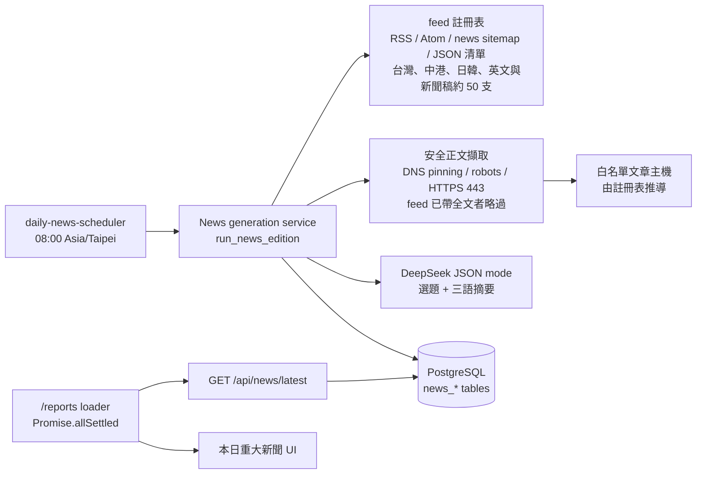
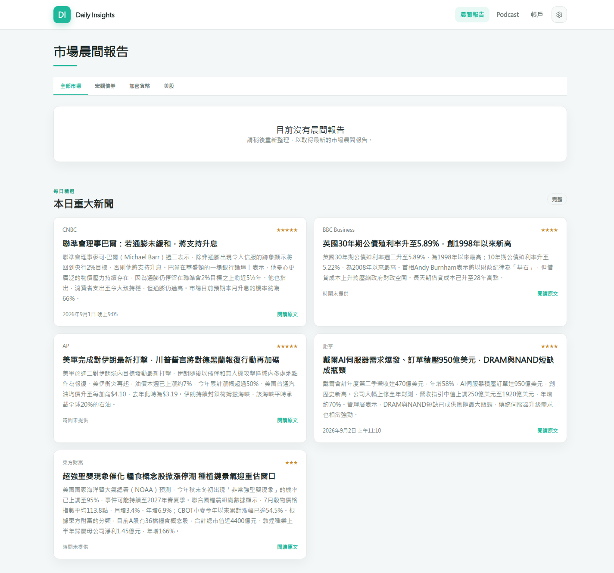
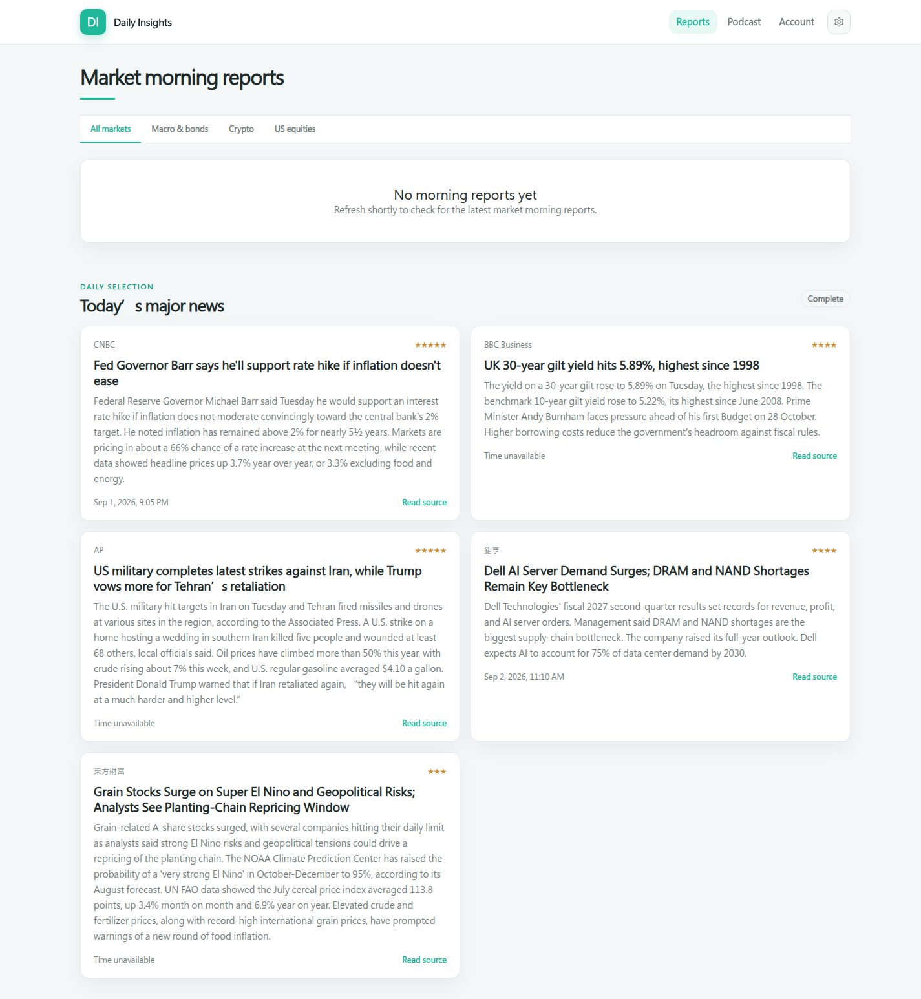
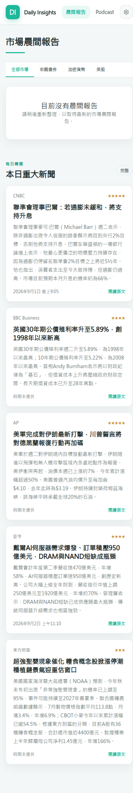
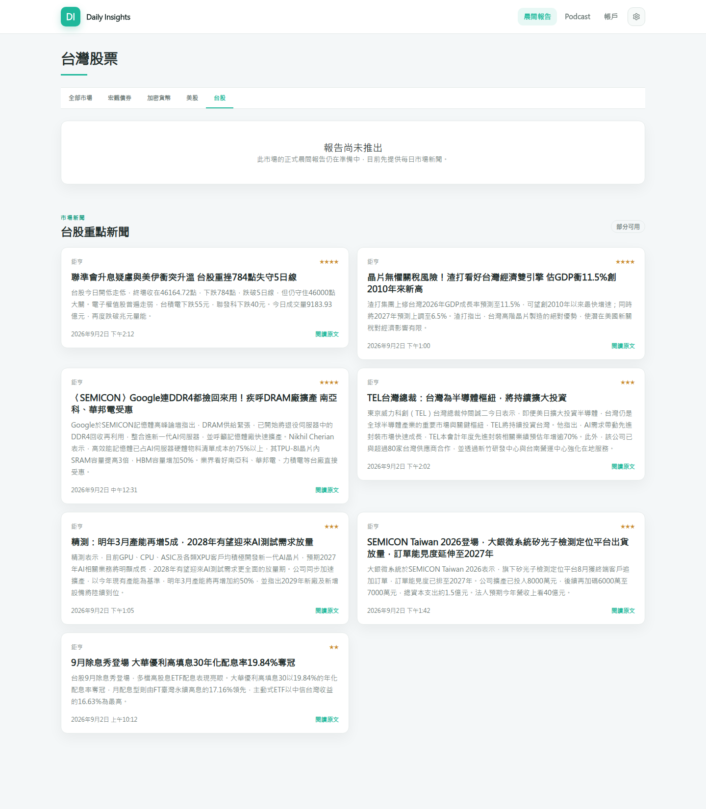
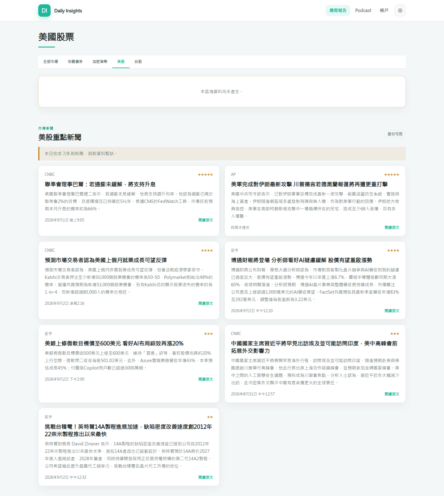

# 每日重大新聞（Daily news）

狀態：API、排程器、資料表與客戶端 UI 已實作並有測試；正式環境以
`DAILY_INSIGHTS_DAILY_NEWS_ENABLED` 旗標 gating，第一次部署時保持關閉，經本地
`--once` 驗證後再啟用。實作與部署接線的細節見
[專案審查基準](../reviews/2026-09-02-project-review.md) 的 D-02、B-05 至 B-09。

本功能在路線圖既有階段之外交付，不影響 Podcast 試點與三市場晨報的驗收條件。
它使用 DeepSeek 作為選題與摘要模型，但不是 Phase 5 對話功能的一部分；模型設定
沿用相同的 `DAILY_INSIGHTS_MODEL_*` 變數。

## 範圍

- 每日產生一版「本日重大新聞」，最多五則，附三語系標題與摘要。
- 只從白名單新聞來源擷取正文；候選一律來自各來源自己的 RSS、Atom、news sitemap
  或 JSON 清單（feed 註冊表是唯一的探索路徑，白名單也由註冊表推導）。文章正文不
  落地，只保存來源中繼資料、摘要與 SHA-256 內容摘要。
- 顯示在客戶報告首頁的清單下方；所有已驗證組織共用同一版，不受市場可見性政策
  影響。
- 不提供後台編輯、人工覆核或客戶端篩選。

## 流程

執行順序：

1. 排程器在台北時間 08:00 觸發當日版本。若當日結果為 `unavailable` 或執行時拋出
   例外，每 30 分鐘重試一次，直到 12:00 為止；`partial` 不自動重試。
2. `discover_feed_candidates` 依序讀取標記給該市場、且文章主機在白名單內的 feed，
   只保留符合各來源 `link_pattern` 的連結，並以 URL 與標題去重；任一 feed 失敗只
   影響該來源，事件為 `news.feed.failed`。需要金鑰或聯絡信箱的來源在設定缺漏時發
   `news.feed.skipped` 並略過。標記 `language_filter` 的新聞稿 feed 以 `langdetect`
   丟棄中、英、日、韓以外的稿件。
3. 候選先排 feed 已帶全文者（不需擷取），其餘依發佈時間新到舊，每個來源最多
   `max_discovery_per_source` 筆（全球 5、台股與美股 8），總數上限 80 筆。
4. 每筆候選以 SSRF 安全的 client 擷取正文：只允許白名單主機的 443 連接埠、DNS
   解析結果必須全部為公網 IP 且連線固定在該 IP、redirect 逐跳重新驗證、遵守
   `robots.txt`、限制位元組數與內容型別，不帶 cookie 也不讀環境代理設定。feed 已
   帶全文（`provides_full_text`）的候選直接以 feed 內文組成擷取結果，不再請求文章頁。
5. DeepSeek 以 JSON mode 選出最多五則（每個網域至多兩則），再對每則產生
   `zh-hant`、`zh-hans`、`en` 三語摘要。摘要中的數字必須能在原文找到，否則該次
   呼叫視為失敗；每次呼叫失敗最多重試一次並記錄 audit。
6. 結果以不可變的 `news_editions` revision 寫入，狀態為 `complete`（5/5）、
   `partial`（1 到 4）或 `unavailable`（0）。

## 版本規格

同一條管線每天產生三個版本，由 `modules/news/editions.py` 的 `EditionSpec` 定義：

| 版本         | `market_code` | 目標則數 | 探索路徑                                                      | 選題限制                                  |
| ------------ | ------------- | -------- | ------------------------------------------------------------- | ----------------------------------------- |
| 本日重大新聞 | `global`      | 5        | 中港快訊、日韓、英文綜合與新聞稿、鉅亨頭條與國際股市          | 每網域至多 2 則，至少 2 個主題與 2 個市場 |
| 台股重點新聞 | `tw_equity`   | 8        | 台灣媒體 15 支 feed（鉅亨台股、經濟日報、中央社、工商時報等） | 單一來源與市場皆可，至少 2 個主題         |
| 美股重點新聞 | `us_equity`   | 8        | 英文綜合與新聞稿、Guardian 商業、鉅亨國際股市、SEC 8-K        | 每網域至多 4 則，至少 2 個主題            |

各版本只讀取標記給該市場的 feed，選題 prompt 附帶該市場的 `MARKET_FOCUS` 提示，`market`
欄位新增 `taiwan`。排程器依序執行三個版本，任一版本例外不影響其他版本，最差
結果決定是否同日重試。`make generate-daily-news MARKET=tw_equity` 可單獨產生一
個版本。

市場版本顯示在各市場報告頁下方，並受組織的市場可見性政策限制：
`GET /api/news/{market_code}/latest` 對不可見或未定義的市場回 404，內部角色可
預覽所有市場。台股沒有正式報告，其報告頁顯示「報告尚未推出」加台股新聞；原本
以直接網址提供的台股示範數字已移除。

## 來源註冊表

`modules/news/feeds.py` 的 `FEED_SOURCES` 是唯一的探索路徑；每筆 `FeedSource` 記錄
文章主機（`hostname`）、feed URL、`kind`、`link_pattern`、市場標記、`poll_group`、
`max_age_hours`、`provides_full_text` 與 adapter 需要的映射。文章白名單由所有
`hostname` 推導，`DAILY_INSIGHTS_NEWS_EXTRA_HOSTNAMES` 只能加入主機、
`DAILY_INSIGHTS_NEWS_BLOCKED_HOSTNAMES` 只能排除主機（排除註冊表主機等於停用該來源）。

| 分組（`poll_group`）   | 來源                                                                                                                                         | `kind`                         | 市場標記                      |
| ---------------------- | -------------------------------------------------------------------------------------------------------------------------------------------- | ------------------------------ | ----------------------------- |
| 中文快訊（`flash`）    | 財聯社、金十數據、華爾街見聞（皆帶全文）、東方財富快訊、新浪財經、澎湃新聞、界面新聞（第三方全文 feed）                                      | `json_list`、`rss_full`        | `global` 加預留的 `cn_equity` |
| 台灣（`fast`）         | 鉅亨台股、經濟日報要聞與產業、中央社財經、ETtoday 財經、科技新報與財經新報、自由財經、INSIDE（全文）、遠見、旺得富、工商時報、今周刊、風傳媒 | `rss`、`rss_full`、sitemap     | `tw_equity`                   |
| 香港（`fast`）         | 經濟通四個分類、香港電台財經、星島頭條（只保留財經、地產與中國分類）                                                                         | `rss`                          | `global` 加預留的 `hk_equity` |
| 日韓（`normal`）       | 東洋経済、ダイヤモンド、共同通信（排除 `/pr/` 通稿）、日經速報 RDF 鏡像、한국경제 증권與 경제                                                | `rss`                          | `global`                      |
| 英文（`normal`）       | WSJ 市場、MarketWatch 頭條、Investing.com 兩個分類、Forbes、TheStreet（全文）、City A.M.（全文）、Guardian 商業／國際／政治（全文，需金鑰）  | `rss`、`rss_full`、`json_list` | 多數 `global` 加 `us_equity`  |
| 新聞稿                 | GlobeNewswire 財報（`flash`）、併購、公司公告；PR Newswire 金融服務；SEC EDGAR 8-K Atom（需聯絡信箱，僅 `us_equity`）                        | `rss`                          | `global` 加 `us_equity`       |
| 鉅亨其他分類（`fast`） | 頭條（`global`）、國際股市（`global` 加 `us_equity`）                                                                                        | `rss`                          |                               |

adapter 種類：`rss` 同時處理 RSS 2.0、RSS 1.0／RDF（`dc:date`）與 Atom（`link href`、
`updated`）；`rss_full` 另讀 `content:encoded`（或第三方 feed 的 `description`），內文
少於 200 字元視為摘要而非全文；`news_sitemap` 讀 Google news sitemap 的
`loc`／`news:title`／`news:publication_date`；`json_list` 依 `JsonListMapping` 讀任意
JSON 清單（dot-notation 欄位、`unix_s`／`unix_ms`／`iso`／`datetime_str` 時間、
金十的 JS 前綴剝除、東方財富的每次請求隨機 `r` 參數）。

2026-09-03 實測後未納入的來源與原因：

- CNBC、BBC、AP：RSS 或文章頁回 403，或 robots.txt 封鎖爬蟲，候選無法擷取。
- 鉅亨 RSS 的 `content:encoded` 只有約 300 字元的導言，因此鉅亨維持 `rss` 並走擷取。
- Mining.com 回 403、Benzinga feed 回 404、PR Newswire 全站清單回 404、Nasdaq feed
  逾時無回應。
- TheStreet 的 `/.rss/full/` 以 308 轉址到固定 feed id，註冊表直接使用轉址後的 URL。
- 規格 4.6 的 Webz.io 與 Marketaux 為後續選項，未實作。

## 來源監控

- 每個 feed 讀取後先看最新一則的發佈時間，超過該來源的 `max_age_hours`（預設 24
  小時）就發 `news.feed.stale`（含 `age_hours`），候選仍會進入後續流程，由選題決定
  取捨；正常時發 `news.feed.ok`（含 `count`、`newest_age_minutes`、`full_text` 與
  `dropped_language`）。回 HTTP 200 但內容停在數月前的殭屍 feed 只有這個檢查能看出來。
- 缺金鑰或聯絡信箱的來源發 `news.feed.skipped`（`reason` 為 `missing_credential` 或
  `missing_contact_email`）。
- 去重後候選數低於 `target_items * 2` 時發 `news.candidates.below_floor`，版本狀態
  沿用既有的 `partial`／`unavailable` 判定。feed 註冊表是唯一的探索路徑，這是整批
  來源失效時最早的警訊。
- 所有事件經 `core/logging.py` 的 stderr handler 輸出，`docker logs` 可直接查看；告警
  送達仍待另案接上。

## 版本與重試語意

- 每個 `edition_date` 可有多個 `revision`，舊版本不會被修改或刪除。
- `input_digest` 由候選集合、模型名稱與選題準則摘要計算。若最新版本為
  `complete` 且 `input_digest` 相同，重跑為 no-op；`partial` 與 `unavailable`
  允許以相同輸入建立新版本。
- 讀取 API 永遠回傳當日最新 revision；沒有當日版本時回傳 `unavailable`。
- 手動重跑：`make generate-daily-news` 在開發環境以 `--once` 產生一次，可傳
  `EDITION_DATE=YYYY-MM-DD`，但服務只允許產生台北時間的當日版本。

## 資料表

| 資料表                   | 內容                                                                                                                                 |
| ------------------------ | ------------------------------------------------------------------------------------------------------------------------------------ |
| `news_editions`          | 每日版本、`market_code`、revision、`input_digest`、模型與 prompt 版本、狀態、警語                                                    |
| `news_items`             | 入選新聞的來源中繼資料、主題、重要性、內容摘要、數值事實，以及選稿階段的 `market` 與 `event_key`（migration 0012 之前的版本為 null） |
| `news_presentations`     | 每則新聞的三語標題與摘要                                                                                                             |
| `news_generation_audits` | 每次模型呼叫的 stage、locale、token、延遲、request id 與失敗代碼                                                                     |

文章正文與 prompt 內容不寫入任何資料表。

## 設定

| 變數                                            | 用途                                                                        | 正式環境來源             |
| ----------------------------------------------- | --------------------------------------------------------------------------- | ------------------------ |
| `DAILY_INSIGHTS_DAILY_NEWS_ENABLED`             | `true`／`false`，關閉時排程器只維持 heartbeat                               | GitHub Variables         |
| `DAILY_INSIGHTS_NEWS_EXTRA_HOSTNAMES`           | 逗號分隔的精確主機名稱，加入註冊表推導的白名單                              | GitHub Variables，可省略 |
| `DAILY_INSIGHTS_NEWS_BLOCKED_HOSTNAMES`         | 逗號分隔的精確主機名稱，從白名單排除（停用該來源的 feed）                   | GitHub Variables，可省略 |
| `DAILY_INSIGHTS_GUARDIAN_API_KEY`               | Guardian Content API 金鑰；未設定時 Guardian 三個 feed 略過                 | GitHub Secrets，可省略   |
| `DAILY_INSIGHTS_SEC_CONTACT_EMAIL`              | SEC EDGAR 要求的聯絡信箱，寫入 User-Agent；未設定時 8-K feed 略過           | GitHub Variables，可省略 |
| `DAILY_INSIGHTS_MODEL_NAME`                     | DeepSeek 模型名稱，預設 `deepseek-chat`                                     | GitHub Variables，可省略 |
| `DAILY_INSIGHTS_MODEL_API_BASE_URL`             | 必須是 HTTPS 絕對 URL，預設 `https://api.deepseek.com`                      | GitHub Variables，可省略 |
| `DAILY_INSIGHTS_MODEL_API_KEY`                  | 啟用時必填，不得為 placeholder                                              | GitHub Secrets           |
| `DAILY_INSIGHTS_MODEL_TIMEOUT_SECONDS`          | 單次模型呼叫逾時，預設 120 秒；選題 prompt 約 28k token，實測需 30 到 45 秒 | 開發環境                 |
| `DAILY_INSIGHTS_NEWS_FETCH_TIMEOUT_SECONDS`     | 正文擷取逾時，預設 25 秒                                                    | 開發環境                 |
| `DAILY_INSIGHTS_NEWS_DISCOVERY_TIMEOUT_SECONDS` | 讀取單一 feed 的逾時，預設 30 秒                                            | 開發環境                 |

`core/config.py` 在啟用時會驗證 provider 為 `deepseek`、URL 為 HTTPS、API key 與
Guardian 金鑰不是 placeholder，且兩個主機名稱清單只含精確主機；不符合時服務啟動即失敗。

## 部署

- `compose.production.yaml` 的 `daily-news-scheduler` 與 API 使用相同映像，唯讀
  檔案系統、`cap_drop: ALL`，healthcheck 以 `/tmp/daily-news-heartbeat` 的更新
  時間判斷。
- `scripts/production/deploy.sh` 與晨報一致：旗標必須是 `true` 或 `false`，為
  `true` 時要求 `DAILY_INSIGHTS_MODEL_API_KEY`；收斂時同時啟動 `api`、`web`、
  `morning-report-scheduler`、`daily-news-scheduler`。
- `release.yml` 從 production 環境傳遞上述變數；`DAILY_INSIGHTS_DAILY_NEWS_ENABLED`
  是必填變數，缺少時部署驗證失敗。

啟用步驟：

1. 在開發環境的 `apps/api/.env` 設定 DeepSeek key，執行
   `make generate-daily-news`，確認候選、擷取與三語摘要都正常。
2. 在 GitHub production 環境新增 `DAILY_INSIGHTS_MODEL_API_KEY` secret。
3. 把 `DAILY_INSIGHTS_DAILY_NEWS_ENABLED` 改為 `true`，以 `workflow_dispatch`
   重新部署。
4. 隔日 08:00 後檢查 `docker logs daily-insights-daily-news-scheduler` 與
   `/api/news/latest`。

## 畫面

2026-09-02 本機以 `make generate-daily-news` 產生的 `complete` 版本：

| 繁中桌面版                                           | 英文桌面版                                      | 繁中手機版                                          |
| ---------------------------------------------------- | ----------------------------------------------- | --------------------------------------------------- |
|  |  |  |

市場版本（2026-09-02 本機，台股 7/8、美股 7/8）：

| 台股報告頁（報告尚未推出加台股新聞）                | 美股報告頁（報告區塊下方加美股新聞）                |
| --------------------------------------------------- | --------------------------------------------------- |
|  |  |

## 驗收條件

- 契約腳本、compose 模型驗證與部署腳本都認得五個服務。
- 旗標為 `false` 時排程器容器維持健康且不呼叫任何外部服務。
- 相同輸入下 `complete` 版本不會重複產生；`unavailable` 版本可以重新生成。
- 排程器在 runner 拋出例外時不會結束程序，並在當日視窗內重試。
- 報告頁在新聞 API 失敗時仍顯示報告清單，新聞區塊顯示 unavailable。
- 非白名單主機、非 443 連接埠、私有 IP 與 redirect 到未核准目標都被拒絕。
- 摘要中的數字與原文不符時該則新聞不入選。

## 已知限制

- 只有一個排程器實例；多實例同時執行時依賴 PostgreSQL advisory lock 避免重複
  寫入，但候選探索與擷取仍會重複執行。
- 探索一律讀全部 feed，`poll_group` 只是給未來常駐 poller 的建議頻率；Benzinga 這類
  一次只回兩則的來源目前沒有納入。
- Twelve Data 的 `/press_releases` 已評估不採用：必須帶 symbol 查詢、沒有原文
  URL、內容為付費通稿且近乎沒有當日稿件（2026-09-02 實測 NVDA 近 3 天 0 筆）。
- Reuters 對非瀏覽器請求回應 `401`，CNBC、BBC 與 AP 封鎖爬蟲，均不在註冊表內。
- WSJ 與日經的文章頁有付費牆，Forbes、Investing.com 與 MarketWatch 的文章頁對爬蟲
  回 403 或拒絕擷取，這些候選會在擷取階段以 `news.source.failed` 記錄；feed 仍保留是
  因為標題與時間對監控有用，若要停用可用 `DAILY_INSIGHTS_NEWS_BLOCKED_HOSTNAMES`。
  SEC 8-K 的連結是申報索引頁，摘要品質取決於索引頁文字。
- `langdetect` 對短標題的判斷不穩定，因此只在新聞稿 feed 啟用語言過濾。
- 沒有人工覆核流程；若模型選題或摘要品質不佳，只能調整
  `modules/news/prompts` 中的選題準則後重新產生。
