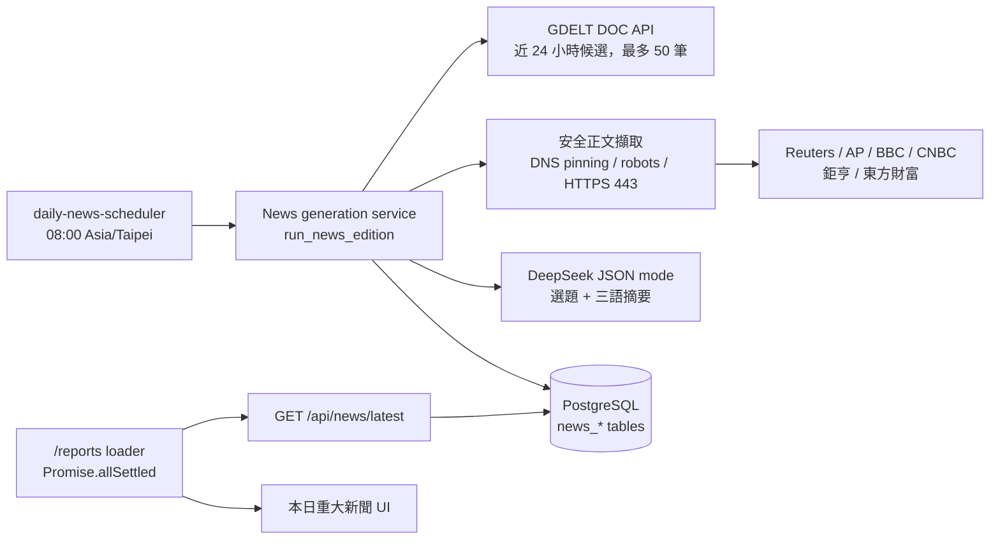

# 每日重大新聞（Daily news）

狀態：API、排程器、資料表與客戶端 UI 已實作並有測試；正式環境以
`DAILY_INSIGHTS_DAILY_NEWS_ENABLED` 旗標 gating，第一次部署時保持關閉，經本地
`--once` 驗證後再啟用。實作與部署接線的細節見
[專案審查基準](../reviews/2026-09-02-project-review.md) 的 D-02、B-05 至 B-09。

本功能在路線圖既有階段之外交付，不影響 Podcast 試點與三市場晨報的驗收條件。
它使用 DeepSeek 作為選題與摘要模型，但不是 Phase 5 對話功能的一部分；模型設定
沿用相同的 `DAILY_INSIGHTS_MODEL_*` 變數。

## 範圍

- 每日產生一版「本日重大新聞」，最多五則，附三語系標題與摘要。
- 只從固定白名單的六個新聞來源擷取正文；文章正文不落地，只保存來源中繼資料、
  摘要與 SHA-256 內容摘要。
- 顯示在客戶報告首頁的清單下方；所有已驗證組織共用同一版，不受市場可見性政策
  影響。
- 不提供後台編輯、人工覆核或客戶端篩選。

## 流程

執行順序：

1. 排程器在台北時間 08:00 觸發當日版本。若當日結果為 `unavailable` 或執行時拋出
   例外，每 30 分鐘重試一次，直到 12:00 為止；`partial` 不自動重試。
2. `discover_candidates` 以白名單網域查詢 GDELT DOC API 近 24 小時的文章，過濾
   非 HTTPS、非白名單主機與時間窗外的項目，並以 URL 與標題去重。GDELT 的 HTTPS
   端點實測經常需要 20 到 45 秒回應且偶爾連線失敗，因此探索逾時預設 60 秒並在
   失敗時重試一次；兩次都失敗才視為無候選。
3. 候選依 GDELT `seendate` 新到舊排序，每個來源最多 5 筆，總數上限 20 筆。
4. 每筆候選以 SSRF 安全的 client 擷取正文：只允許白名單主機的 443 連接埠、DNS
   解析結果必須全部為公網 IP 且連線固定在該 IP、redirect 逐跳重新驗證、遵守
   `robots.txt`、限制位元組數與內容型別，不帶 cookie 也不讀環境代理設定。
5. DeepSeek 以 JSON mode 選出最多五則（每個網域至多兩則），再對每則產生
   `zh-hant`、`zh-hans`、`en` 三語摘要。摘要中的數字必須能在原文找到，否則該次
   呼叫視為失敗；每次呼叫失敗最多重試一次並記錄 audit。
6. 結果以不可變的 `news_editions` revision 寫入，狀態為 `complete`（5/5）、
   `partial`（1 到 4）或 `unavailable`（0）。

## 版本與重試語意

- 每個 `edition_date` 可有多個 `revision`，舊版本不會被修改或刪除。
- `input_digest` 由候選集合、模型名稱與選題準則摘要計算。若最新版本為
  `complete` 且 `input_digest` 相同，重跑為 no-op；`partial` 與 `unavailable`
  允許以相同輸入建立新版本。
- 讀取 API 永遠回傳當日最新 revision；沒有當日版本時回傳 `unavailable`。
- 手動重跑：`make generate-daily-news` 在開發環境以 `--once` 產生一次，可傳
  `EDITION_DATE=YYYY-MM-DD`，但服務只允許產生台北時間的當日版本。

## 資料表

| 資料表                   | 內容                                                               |
| ------------------------ | ------------------------------------------------------------------ |
| `news_editions`          | 每日版本、revision、`input_digest`、模型與 prompt 版本、狀態、警語 |
| `news_items`             | 入選新聞的來源中繼資料、主題、重要性、內容摘要與數值事實           |
| `news_presentations`     | 每則新聞的三語標題與摘要                                           |
| `news_generation_audits` | 每次模型呼叫的 stage、locale、token、延遲、request id 與失敗代碼   |

文章正文與 prompt 內容不寫入任何資料表。

## 設定

| 變數                                            | 用途                                                   | 正式環境來源             |
| ----------------------------------------------- | ------------------------------------------------------ | ------------------------ |
| `DAILY_INSIGHTS_DAILY_NEWS_ENABLED`             | `true`／`false`，關閉時排程器只維持 heartbeat          | GitHub Variables         |
| `DAILY_INSIGHTS_NEWS_ALLOWED_HOSTNAMES`         | 逗號分隔的精確主機名稱白名單                           | GitHub Variables，可省略 |
| `DAILY_INSIGHTS_MODEL_NAME`                     | DeepSeek 模型名稱，預設 `deepseek-chat`                | GitHub Variables，可省略 |
| `DAILY_INSIGHTS_MODEL_API_BASE_URL`             | 必須是 HTTPS 絕對 URL，預設 `https://api.deepseek.com` | GitHub Variables，可省略 |
| `DAILY_INSIGHTS_MODEL_API_KEY`                  | 啟用時必填，不得為 placeholder                         | GitHub Secrets           |
| `DAILY_INSIGHTS_NEWS_FETCH_TIMEOUT_SECONDS`     | 正文擷取逾時，預設 25 秒                               | 開發環境                 |
| `DAILY_INSIGHTS_NEWS_DISCOVERY_TIMEOUT_SECONDS` | GDELT 探索逾時，預設 60 秒，失敗會重試一次             | 開發環境                 |

`core/config.py` 在啟用時會驗證 provider 為 `deepseek`、URL 為 HTTPS 且 API key
不是 placeholder；不符合時服務啟動即失敗。

## 部署

- `compose.production.yaml` 的 `daily-news-scheduler` 與 API 使用相同映像，唯讀
  檔案系統、`cap_drop: ALL`，healthcheck 以 `/tmp/daily-news-heartbeat` 的更新
  時間判斷。
- `scripts/production/deploy.sh` 與晨報一致：旗標必須是 `true` 或 `false`，為
  `true` 時要求 `DAILY_INSIGHTS_MODEL_API_KEY`；收斂時同時啟動 `api`、`web`、
  `morning-report-scheduler`、`daily-news-scheduler`。
- `release.yml` 從 production 環境傳遞上述變數；`DAILY_INSIGHTS_DAILY_NEWS_ENABLED`
  是必填變數，缺少時部署驗證失敗。

啟用步驟：

1. 在開發環境的 `apps/api/.env` 設定 DeepSeek key，執行
   `make generate-daily-news`，確認候選、擷取與三語摘要都正常。
2. 在 GitHub production 環境新增 `DAILY_INSIGHTS_MODEL_API_KEY` secret。
3. 把 `DAILY_INSIGHTS_DAILY_NEWS_ENABLED` 改為 `true`，以 `workflow_dispatch`
   重新部署。
4. 隔日 08:00 後檢查 `docker logs daily-insights-daily-news-scheduler` 與
   `/api/news/latest`。

## 驗收條件

- 契約腳本、compose 模型驗證與部署腳本都認得五個服務。
- 旗標為 `false` 時排程器容器維持健康且不呼叫任何外部服務。
- 相同輸入下 `complete` 版本不會重複產生；`unavailable` 版本可以重新生成。
- 排程器在 runner 拋出例外時不會結束程序，並在當日視窗內重試。
- 報告頁在新聞 API 失敗時仍顯示報告清單，新聞區塊顯示 unavailable。
- 非白名單主機、非 443 連接埠、私有 IP 與 redirect 到未核准目標都被拒絕。
- 摘要中的數字與原文不符時該則新聞不入選。

## 已知限制

- 只有一個排程器實例；多實例同時執行時依賴 PostgreSQL advisory lock 避免重複
  寫入，但候選探索與擷取仍會重複執行。
- GDELT 對來源的涵蓋不完整，候選數量每日不同；其 HTTPS 端點延遲高且不穩定，
  是 `unavailable` 版本最常見的原因。
- Reuters 對非瀏覽器請求回應 `401`，實際上不會有 Reuters 的候選入選。
- AP、BBC 與東方財富的頁面沒有可解析的發佈時間，UI 會顯示「時間未提供」；
  CNBC 與東方財富的正文開頭會混入站內導覽文字。
- 沒有人工覆核流程；若模型選題或摘要品質不佳，只能調整
  `modules/news/prompts` 中的選題準則後重新產生。
