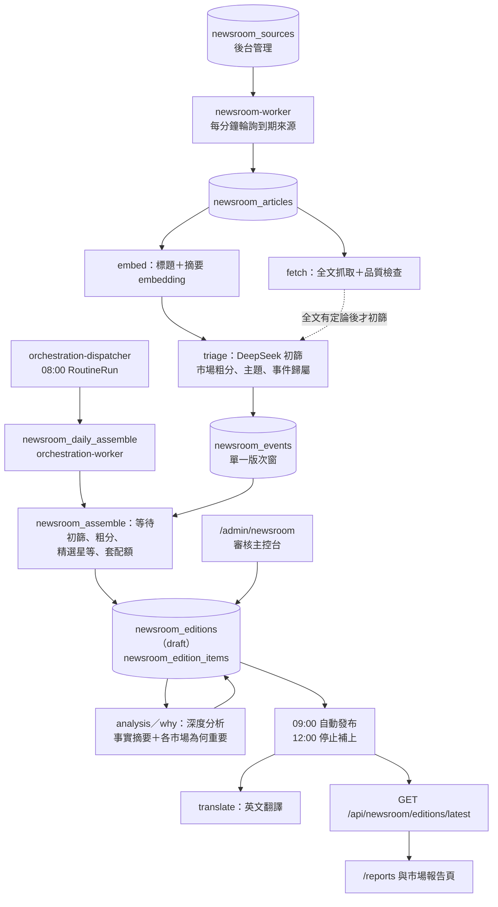

# 重點新聞（Newsroom）

狀態：收稿、初篩與事件分群、08:00 組稿、深度分析、發布、翻譯、讀者 API 與後台審核
主控台均已實作並有測試。整條管線由 `DAILY_INSIGHTS_NEWSROOM_ENABLED` 旗標控制，
預設關閉；關閉時 `newsroom-worker` 只維持心跳，08:00 組稿 function 以 `no_change`
略過。決策來源與跨模組契約見
[重點新聞 Newsroom 管線重構規格](../specs/newsroom-pipeline.md)；本文件描述系統
目前的實際行為。

舊的每日新聞管線（`modules/news`、`news_*` 資料表、`news_*` orchestration functions
與「新聞管理」後台頁）已在切換時移除，歷史版次已搬移到 `newsroom_*` 資料表，見
[舊版次資料搬移](#舊版次資料搬移)。

## 產品範圍

- 每天（含週末、假日）為 `global`、`tw_equity`、`us_equity` 三個市場各產生一版精選
  新聞。選題單位是「事件」：同一事件的多家報導合併成一則，報導家數是重要性訊號。
- 每則上架內容：標題、2–3 句只寫事實的摘要（綜合多來源）、各市場 1–2 句「為何重要」、
  相關標的（連到站內儀表板）與來源列表。不做多空或情緒判斷，讀者端不提供篩選。
- 同一事件可同時出現在多個市場版：標題、摘要、來源與相關標的共用，「為何重要」依
  市場各寫一段。
- AI 在 08:00 產生草稿；管理員可在 09:00 前改字、換稿、排序與核准。09:00 仍未核准的
  草稿自動發布，發布後仍可編修或隱藏。
- 全文只存在 Postgres 供分析使用，30 天後清除，永不提供給讀者。
- 繁體中文是唯一可編輯的語言；簡體中文以 OpenCC `tw2sp` 同步轉換，英文於發布後由
  LLM 非同步翻譯，未完成時英文頁不顯示該則。

## 元件與資料流

```mermaid
flowchart TB
    SRC[("newsroom_sources<br/>後台管理")] --> POLL["newsroom-worker<br/>每分鐘輪詢到期來源"]
    POLL --> ART[("newsroom_articles")]
    ART --> FETCH["fetch：全文抓取＋品質檢查"]
    ART --> EMB["embed：標題＋摘要 embedding"]
    EMB --> TRI["triage：DeepSeek 初篩<br/>市場粗分、主題、事件歸屬"]
    FETCH -. 全文有定論後才初篩 .-> TRI
    TRI --> EVT[("newsroom_events<br/>單一版次窗")]
    DISP["orchestration-dispatcher<br/>08:00 RoutineRun"] --> JOB["newsroom_daily_assemble<br/>orchestration-worker"]
    JOB --> ASM["newsroom_assemble：等待初篩、粗分、<br/>精選星等、套配額"]
    EVT --> ASM
    ASM --> ED[("newsroom_editions（draft）<br/>newsroom_edition_items")]
    ED --> ANA["analysis／why：深度分析<br/>事實摘要＋各市場為何重要"]
    ANA --> ED
    ADMIN["/admin/newsroom<br/>審核主控台"] --> ED
    ED --> PUB["09:00 自動發布<br/>12:00 停止補上"]
    PUB --> EN["translate：英文翻譯"]
    PUB --> API["GET /api/newsroom/editions/latest"]
    API --> UI["/reports 與市場報告頁"]
```

| 程序                   | 角色（`DAILY_INSIGHTS_RUNTIME_ROLE`） | 在新聞管線中的工作                                                          |
| ---------------------- | ------------------------------------- | --------------------------------------------------------------------------- |
| `newsroom-worker`      | `newsroom-worker`                     | 來源輪詢、全文、embedding、初篩、分析、為何重要、翻譯、發布與清除的常駐迴圈 |
| `orchestration-worker` | `orchestration-worker`                | 執行 08:00 routine 中的 `newsroom_assemble` function（組稿）                |
| `api`                  | `api`                                 | 讀者 API 與後台 API；只改資料列狀態，不呼叫 LLM                             |

`newsroom-worker` 由 `python -m daily_insights_api.scripts.run_newsroom_worker` 啟動，
本機與正式環境的 Compose 都會預設啟動它。旗標關閉時它不連資料庫，只每隔
`DAILY_INSIGHTS_NEWSROOM_WORKER_POLL_SECONDS` 更新 `/tmp/newsroom-worker-heartbeat`；
開啟時才建立 provider client 與各階段迴圈。runtime role 不是 `newsroom-worker` 時
直接拒絕啟動。

## 時間與版次窗

時區一律 `Asia/Taipei`（`modules/newsroom/clock.py`）。

| 時間                              | 行為                                                                                                   |
| --------------------------------- | ------------------------------------------------------------------------------------------------------ |
| `[D-1 08:00, D 08:00)`            | 版次 `D` 的收稿窗，以文章 `first_seen_at` 判定並寫入 `edition_date`；08:00 之後看到的文章屬於 `D+1`    |
| `D 08:00`                         | 統一 routine 觸發 `newsroom_assemble`；最多等到 08:10 讓窗內 embedding／初篩完成，逾時者忽略並記錄數量 |
| `D 09:00`（`auto_publish_at`）    | 仍為 `draft` 的版次自動發布（`published_by_user_id = NULL`）                                           |
| `D 12:00`（`late_fill_deadline`） | 仍未完成的項目設 `abandoned_at` 並通知                                                                 |
| 每日 03:00                        | 清除 `first_seen_at` 早於 30 天的文章正文                                                              |

`auto_publish_at` 與 `late_fill_deadline` 存在每個版次的欄位上，便於測試與個案調整。
事件只存在於單一版次窗內：跨日的同一事件一律視為新事件，隱藏也只對當版有效。

## 資料表

完整欄位以 `apps/api/src/daily_insights_api/modules/newsroom/models.py` 為準。

| 資料表                   | 內容                                                                                                                      |
| ------------------------ | ------------------------------------------------------------------------------------------------------------------------- |
| `newsroom_sources`       | 來源設定（格式、網址、網域、涵蓋市場、信任等級 1–3、權重 0.5–2.0、輪詢間隔 5–1440 分鐘、啟用）與健康狀態欄位              |
| `newsroom_articles`      | 每個發布者 URL 一列（`url_hash` 唯一）；全文、`fetch`／`embed`／`triage` 三組佇列欄位、`embedding vector(1536)`、初篩結果 |
| `newsroom_events`        | 單一版次窗內的事件；共用的三語標題與摘要、相關標的；`analysis` 與 `en` 兩組佇列欄位、`en_source_digest`                   |
| `newsroom_editions`      | 每個 `(edition_date, market_code)` 唯一的一版；`draft`／`published`、`selection_mode`、發布時間與發布者                   |
| `newsroom_edition_items` | 某事件在某市場版的項目；排序、星等、粗分快照、`origin`、三語「為何重要」與 `why` 佇列欄位、移除／隱藏／放棄時間           |
| `newsroom_edit_log`      | 每個管理員動作的 append-only 紀錄（`before`／`after` JSONB）                                                              |
| `newsroom_llm_calls`     | 每次 LLM／embedding 呼叫的稽核：stage、model、prompt 版本、token、延遲、request id、錯誤碼；不存 prompt 與正文            |

`selection_mode` 為 `pending`、`editor`（精選成功）、`fallback`（精選失敗改用粗分）或
`legacy`（舊管線搬移）。項目 `origin` 為 `model`、`manual`（管理員加入）或 `legacy`。

## 佇列與重試

所有可失敗的工作都以「資料列即佇列」表示，不使用 checkpoint 表。每個 stage 在自己的
資料列上有 `<stage>_status`、`<stage>_attempts`、`<stage>_next_attempt_at`、
`<stage>_error_code` 四個欄位，共用實作在 `modules/newsroom/queue.py`。

| Stage       | 資料表                   | 欄位前綴   | 完成狀態 | `max_attempts` | 並行數                                           |
| ----------- | ------------------------ | ---------- | -------- | -------------- | ------------------------------------------------ |
| `fetch`     | `newsroom_articles`      | `fetch`    | `done`   | 4              | `DAILY_INSIGHTS_NEWSROOM_FETCH_CONCURRENCY`（4） |
| `embed`     | `newsroom_articles`      | `embed`    | `done`   | 6              | 2                                                |
| `triage`    | `newsroom_articles`      | `triage`   | `done`   | 6              | 4                                                |
| `analysis`  | `newsroom_events`        | `analysis` | `ready`  | 5              | 1                                                |
| `why`       | `newsroom_edition_items` | `why`      | `ready`  | 5              | 1                                                |
| `translate` | `newsroom_events`        | `en`       | `ready`  | 6              | 1                                                |

- **領取**：`<stage>_status = 'pending'` 且 `<stage>_next_attempt_at` 為 NULL 或已到期
  即可領取。worker 以 `SELECT … FOR UPDATE SKIP LOCKED` 取列，同一交易內
  `attempts += 1` 並把 `next_attempt_at` 推遲 10 分鐘作為租約。worker 崩潰時租約到期
  即自然重試。
- **完成**：寫回結果並清除 `next_attempt_at` 與 `error_code`。寫回以 `attempts` 做
  fence：租約過期後被重新領取的舊 attempt 無法覆寫較新的結果。
- **可重試失敗**（逾時、連線錯誤、429、5xx、JSON 或 schema 不合法、未預期例外）：
  記錄錯誤碼，依 1、2、4、8… 分鐘指數退避，上限 60 分鐘；`Retry-After` 較長時遵守
  （最多 6 小時）。`attempts` 達 `max_attempts` 後轉為 `failed`。
- **不可重試失敗**（provider 回 400／401／402／403／404、金鑰未設定）：直接 `failed`，
  並發出 `stage_fatal` Slack 通知，同一 stage 與錯誤碼每小時最多一次。
- `failed` 不會自動恢復；需要人工重新排入，操作見
  [重點新聞維運手冊](../runbooks/news-recovery.md)。

各 stage 之間只透過資料列欄位交接，每個欄位只有一個寫入者會把它設成 `pending`：

| 交接                     | 寫入者                          | 規則                                                                                                             |
| ------------------------ | ------------------------------- | ---------------------------------------------------------------------------------------------------------------- |
| 新文章 → 全文、embedding | 收稿（插入文章時）              | `fetch_status = pending`、`embed_status = pending`；feed 自帶且通過品質檢查的全文直接寫入，`fetch_status = done` |
| embedding → 初篩         | embed handler（成功時）         | `triage_status = pending`                                                                                        |
| 全文 → 初篩              | triage 的領取條件               | 只領取 `fetch_status IN ('done','failed')` 的文章；全文失敗者以標題與摘要初篩                                    |
| 組稿 → 分析              | `newsroom_assemble`             | 入選事件若為 `idle`／`failed`／`needs_body` 則 `analysis_status = pending`；項目 `why_status = pending`          |
| 分析 → 為何重要          | analysis handler                | 同時寫入事件所有未移除項目的「為何重要」並設 `why_status = ready`                                                |
| 發布／修改 → 英文        | publishing 與每分鐘 stale sweep | 可見內容的繁中 digest 改變時 `en_status = pending`                                                               |
| 貼上全文 → 分析          | `set_manual_body`               | 所屬事件若為 `needs_body`，改回 `analysis_status = pending`                                                      |
| 合併／拆分 → 分析        | `events_service`                | 受影響且在版次中的事件 `analysis_status = pending`                                                               |
| 重新分析                 | 後台「重新分析」                | 事件 `analysis_status = pending`，其所有未移除、未隱藏、未放棄項目 `why_status = pending`                        |

## 各階段

### 來源與收稿

- 來源存放於 `newsroom_sources`，初始資料由 seed migration 從舊 feed 註冊表匯入；
  之後在後台「新聞來源管理」新增、修改、停用。支援格式：`rss`、`rdf`、`atom`、
  `rss_full`、`news_sitemap`、`json_list`、`guardian_api`，以及承接管理員池外 URL 的
  固定 `manual` 來源。非執行中的歷史來源見
  [非執行中的新聞來源](inactive-news-sources.md)。
- worker 每分鐘領取 `enabled ∧ next_poll_at <= now()` 的來源（每批最多 32 個、同時
  4 個），以租約推遲 `next_poll_at` 10 分鐘避免重複輪詢；每個來源獨立成敗。
- Feed 請求經 SSRF-safe client：只連公開 HTTPS 位址、遵守 robots.txt、不跟隨 feed
  轉址、限制回應大小。Guardian 等主機有最小請求間隔。
- 需要憑證的來源（Guardian API key、SEC 聯絡信箱）在設定缺漏時略過，`last_error_code`
  記為 `guardian_api_key_missing`／`sec_contact_email_missing`，不計入連續失敗。
- 去重：`url_hash`（SHA-256）唯一；同一版次窗內標題完全相同者略過；發布時間早於
  24 小時的 feed 項目不收；設定 `language_filter` 的來源丟棄其他語言。
- 健康：成功時重置 `consecutive_failures`；失敗時累計並記錄 `last_error_code`。
  連續失敗且距離最後成功（或建立時間）超過 6 小時的來源發出一次 `source_unhealthy`
  通知，恢復成功後重置。

### 全文抓取與品質檢查

- `fetch` stage 讀取原文頁面：只允許來源網域白名單（啟用來源的 `hostname` 加上
  `DAILY_INSIGHTS_NEWS_EXTRA_HOSTNAMES`，扣除 `DAILY_INSIGHTS_NEWS_BLOCKED_HOSTNAMES`），
  最多 3 次轉址且每次重新驗證、頁面上限 1.5 MB、只接受 HTML、遵守 robots.txt。
  管理員送出的池外 URL 允許其本身網域，但仍受 blocked hosts 限制。
- 品質檢查依序：少於 200 字（`too_short`）、導覽字詞比例超過 10%
  （`navigation_heavy`）、與標題相關性過低（`unrelated_to_title`）。不合格為
  `rejected`；付費牆、存取被拒、404／410、非 HTML、過大或 robots 禁止為
  `unavailable`。這些都是最終答案（`fetch_status = done`），只有逾時、連線錯誤、
  429、5xx 會重試。
- 正文上限 40,000 字元，只用於初篩摘錄與分析，不回傳給讀者。

### Embedding、初篩與事件分群

- `embed`：以標題＋feed 摘要（不等全文）呼叫 OpenAI-compatible embedding API，
  預設 `text-embedding-3-small`、1536 維，存入 `pgvector`。成功即排入初篩。
- `triage`：DeepSeek JSON mode、temperature 0。輸入標題、來源、摘要或全文前段，以及
  同一版次窗內 kNN 最相近的 5 個事件（附 `working_title` 與 2 則代表標題）。輸出
  `relevant`、`topic`、三市場 0–100 粗分，以及歸屬既有事件或開新事件。不相關文章
  不歸屬事件。
- 事件寫入以每個版次日期的 advisory lock 序列化；決定開新事件時在鎖內再做一次 kNN，
  與模型呼叫期間新開事件相似度 ≥ 0.88 者改歸屬該事件，避免同一事件被重複開啟。
- 事件可在後台合併（被合併者 `status = merged`、指向目標）或拆分（被拆出的文章
  形成 `created_by = split` 的新事件），受影響且在版次中的事件會重新分析。

### 08:00 組稿

統一 routine `daily_market_update_v1` 每天 08:00 建立 `newsroom_daily_assemble` job，
由 `orchestration-worker` 在獨立的 `newsroom` provider 下執行 `newsroom_assemble`
function，不與其他 provider 共用鎖。流程冪等：

1. 等待窗內 `embed`／`triage` 仍為 `pending` 的文章，最多到 08:10；剩餘數量寫入
   `ignored_pending_triage`。
2. 每市場計算事件粗分：`max(文章市場分數 × 來源權重)`，每多一個不同來源 +5，
   最多 +20。
3. 只有含至少一篇 `body_status = ok` 文章、且該市場分數大於 0 的事件可入選；取粗分
   前 30 名。
4. 精選（每市場一次 LLM 呼叫，`DAILY_INSIGHTS_NEWSROOM_EDITOR_MODEL`）：輸入事件、
   最多 5 則報導標題與來源、報導家數，輸出每個事件 1–5 星。失敗會在組稿內重試至多
   3 次；仍失敗或遇到不可重試錯誤時改用 `fallback`：依粗分取前 5 名、星等留空，並
   發出 `selection_fallback` 通知。
5. 由程式套配額：5 星全收；4 星最多 5 則；5＋4 星不足 5 則時才以 1–3 星補到 5 則。
6. 建立或重建 `draft` 版次與項目，並把入選事件排入分析。重建時保留管理員加入的
   項目與已移除的項目；已發布的版次不重建。
7. 有任何市場完成組稿時發出一次 `draft_ready` 通知（各市場則數、5 星事件標題、
   未初篩數量、後台連結）。

旗標關閉時 function 回傳 `no_change`；在 08:00 前手動觸發時回傳可重試的
`newsroom_window_open`。其他失敗由統一 orchestration 依一般 function 規則每 30 分鐘
重試至 10:00 soft deadline。需要對特定日期重新組稿時，使用
`make assemble-newsroom [EDITION_DATE=YYYY-MM-DD]`，它在 newsroom-worker 容器中執行
`python -m daily_insights_api.scripts.run_newsroom_assemble`（同樣要求旗標開啟且收稿窗已關閉）。

### 深度分析與「為何重要」

- `analysis`（每事件一次，`DAILY_INSIGHTS_NEWSROOM_ANALYSIS_MODEL`）：輸入事件內
  最多 5 篇有全文的文章（依信任等級、權重排序，每篇截 8,000 字元）、事件所在的市場
  清單與站內儀表板標的清單。輸出標題、事實摘要、相關標的與每個市場的「為何重要」；
  成功時同時寫入事件與各項目，繁中寫入時同步產生簡中。
- 事件沒有任何可用全文時不算失敗，`analysis_status = needs_body`；後台顯示「缺全文」，
  管理員貼上全文後自動重新排入。
- 相關標的必須對應站內既有儀表板（指數、商品、外匯、個股等清單），對不上的丟棄；
  管理員手動編輯時對不上者直接拒絕。
- `why`：事件已分析完成後才被加入其他市場版的項目，只對該項目單獨呼叫一次
  （最多 3 篇文章、每篇 3,000 字元）。

### 發布、晚到補上與放棄

- 管理員可核准單一市場或當日全部草稿，立即發布並寫入編輯紀錄。
- `newsroom-worker` 每分鐘把 `draft ∧ now() >= auto_publish_at` 的版次自動發布。
- 發布後，項目完成分析與「為何重要」即對讀者可見；`now() >= late_fill_deadline` 時
  仍未完成的項目設 `abandoned_at`，並以 `late_fill_abandoned` 通知列出標題。每個版次
  的放棄處理只執行一次（`late_fill_closed_at`）。
- 讀者可見條件：版次 `published` ∧ 未移除 ∧ 未隱藏 ∧ 未放棄 ∧ 事件
  `analysis_status = ready` ∧ 項目 `why_status = ready`，且該語系的標題與摘要存在。
  英文另需事件 `en_status = ready`、`en_source_digest` 等於目前繁中內容的 digest，以及
  項目英文「為何重要」已備妥。

### 多語系

- 繁中由 LLM 產出且是唯一可編輯的語言；所有繁中寫入點（分析、為何重要、後台編輯）
  都同步以 OpenCC `tw2sp` 產生簡中。
- 版次發布時，把可見項目的事件排入 `translate`（`DAILY_INSIGHTS_NEWSROOM_TRANSLATE_MODEL`）。
  翻譯一次寫入事件英文標題、摘要與各可見項目的英文「為何重要」，並記錄當時繁中內容
  的 digest。
- 之後繁中被修改、項目晚到完成或被隱藏，使 digest 改變時重新排入翻譯；每分鐘的
  stale sweep 檢查近 2 天發布的版次，補上發布函式看不到的變化。`failed` 的翻譯不會被
  sweep 自動重試，要等下一次編修或人工重新排入。

### 正文清除

每 10 分鐘檢查一次，清除 `first_seen_at` 早於「最近一次 03:00 減 30 天」的文章正文，
設 `body_status = purged`，只保留中繼資料。實際上每天 03:00 後推進一次。

## 讀者端

- `GET /api/newsroom/editions/latest?market=<global|tw_equity|us_equity>&locale=<zh-hant|zh-hans|en>`
  回傳該市場最近一個 `published` 且在該語系有可見項目、`edition_date` 不晚於台北今日
  的版次，附 `edition_date` 與 `is_today`。回應 `Cache-Control: no-store`。
- 需登入且已更換初始密碼。`global` 版所有會員皆可讀；`tw_equity`、`us_equity` 依組織
  的市場可見性政策開放，內部角色可預覽全部市場。相關標的只在讀者可開啟該儀表板時
  提供連結。
- 每則顯示標題、事實摘要、「為何重要」、相關標的與來源列表。`/reports` 首頁顯示全球版，
  各市場報告頁顯示對應市場版；載入沿用 `Promise.allSettled` 容錯，不影響報告本身。
  非今日版次明確標示日期。
- 舊管線搬移的項目沒有「為何重要」，讀者端照常顯示其標題、摘要與來源。

## 後台審核主控台

`/admin/newsroom`（側邊選單「重點新聞審核」）與 `/admin/newsroom/sources`
（「新聞來源管理」）只限 admin，寫入動作需要 CSRF。後台 API 位於
`/api/admin/newsroom`，只呼叫 newsroom 的 service 函式與佇列狀態變更，不直接呼叫 LLM；
每個動作都寫入 `newsroom_edit_log`。

| 功能     | 說明                                                                                                   |
| -------- | ------------------------------------------------------------------------------------------------------ |
| 版次總覽 | 依日期檢視三個市場版的狀態、自動發布倒數、未初篩與初篩失敗數、`fallback` 警示                          |
| 核准     | 「核准此市場」或「核准全部草稿」，立即發布                                                             |
| 項目編修 | 改標題／摘要、改「為何重要」、移除／還原（草稿）、隱藏／取消隱藏（已發布）、上下排序                   |
| 候選事件 | 依粗分列出尚未入選的事件，可「加入此版」；新加入的項目自動排入分析或單一市場「為何重要」               |
| 事件     | 原文對照（含全文狀態與初篩狀態）、合併其他事件、拆分選取的文章、重新分析                               |
| 全文     | 對「缺全文」或抓不到全文的文章「貼上全文」                                                             |
| 池外文章 | 「手動加入池外文章」：輸入公開 HTTPS 網址，歸入正在審核的版次日期，走完整的抓取 → embedding → 初篩     |
| 來源管理 | 新增、編輯、啟用／停用來源，調整信任等級、權重、輪詢間隔；檢視最後輪詢、最後成功、連續失敗與最後錯誤碼 |

狀態標示：「分析中」、「分析失敗」、「缺全文」、「撰寫『為何重要』中」、「『為何重要』失敗」、
「12:00 未完成已放棄」。

## 通知

`Notifier` 介面目前實作為 Slack incoming webhook（`DAILY_INSIGHTS_NEWSROOM_SLACK_WEBHOOK_URL`）；
未設定時只寫 worker log。通知為 best effort，送出失敗只記 log，不影響管線。訊息內的
後台連結以 `DAILY_INSIGHTS_NEWSROOM_ADMIN_BASE_URL` 組成。

| 種類                  | 發出者              | 時機                                              |
| --------------------- | ------------------- | ------------------------------------------------- |
| `draft_ready`         | `newsroom_assemble` | 08:00 組稿完成（至少一個市場）                    |
| `selection_fallback`  | `newsroom_assemble` | 某市場精選失敗改用粗分排序                        |
| `late_fill_abandoned` | `newsroom-worker`   | 12:00 仍有未完成項目被放棄                        |
| `source_unhealthy`    | `newsroom-worker`   | 來源連續失敗且超過 6 小時沒有成功（每次故障一次） |
| `stage_fatal`         | `newsroom-worker`   | 任一 stage 遇到不可重試錯誤（同錯誤碼每小時一次） |

訊息內容與對應處置見[重點新聞維運手冊](../runbooks/news-recovery.md#slack-通知與處置)。

## 設定

所有設定以 `DAILY_INSIGHTS_` 為前綴，定義於 `core/config.py`。

| 變數                                                                           | 預設                           | 使用者                                     | 用途                                                       |
| ------------------------------------------------------------------------------ | ------------------------------ | ------------------------------------------ | ---------------------------------------------------------- |
| `NEWSROOM_ENABLED`                                                             | `false`                        | newsroom-worker、orchestration-worker、api | 啟用常駐管線與 08:00 組稿；api 用於 orchestration 目錄狀態 |
| `NEWSROOM_LLM_BASE_URL`、`NEWSROOM_LLM_API_KEY`                                | `https://api.deepseek.com`     | newsroom-worker、orchestration-worker      | DeepSeek（OpenAI-compatible）                              |
| `NEWSROOM_TRIAGE_MODEL`、`NEWSROOM_ANALYSIS_MODEL`、`NEWSROOM_TRANSLATE_MODEL` | `deepseek-chat`                | newsroom-worker                            | 初篩、分析與為何重要、英文翻譯的 model                     |
| `NEWSROOM_EDITOR_MODEL`                                                        | `deepseek-chat`                | orchestration-worker                       | 08:00 精選的 model                                         |
| `NEWSROOM_LLM_TIMEOUT_SECONDS`                                                 | `90`                           | 同 LLM                                     | 單次 LLM 呼叫 timeout                                      |
| `NEWSROOM_EMBEDDING_BASE_URL`、`NEWSROOM_EMBEDDING_API_KEY`                    | `https://api.openai.com/v1`    | newsroom-worker                            | OpenAI-compatible embedding                                |
| `NEWSROOM_EMBEDDING_MODEL`、`NEWSROOM_EMBEDDING_TIMEOUT_SECONDS`               | `text-embedding-3-small`、`30` | newsroom-worker                            | embedding model 與 timeout（向量固定 1536 維）             |
| `NEWSROOM_SLACK_WEBHOOK_URL`                                                   | 未設定                         | newsroom-worker、orchestration-worker      | Slack 通知；必須是 `https://hooks.slack.com/` 網址         |
| `NEWSROOM_ADMIN_BASE_URL`                                                      | `http://localhost:3000`        | newsroom-worker、orchestration-worker      | 通知中的後台連結 origin                                    |
| `NEWSROOM_WORKER_POLL_SECONDS`、`NEWSROOM_FETCH_CONCURRENCY`                   | `2`、`4`                       | newsroom-worker                            | 空佇列輪詢間隔（也是停用時的心跳間隔）與全文抓取並行數     |
| `NEWS_EXTRA_HOSTNAMES`、`NEWS_BLOCKED_HOSTNAMES`                               | 空                             | newsroom-worker（blocked 也用於 api）      | 全文白名單增補與封鎖；封鎖也停止輪詢並拒絕池外 URL         |
| `NEWS_FETCH_TIMEOUT_SECONDS`、`NEWS_DISCOVERY_TIMEOUT_SECONDS`                 | `25`、`30`                     | newsroom-worker                            | 全文頁面與 feed 讀取 timeout                               |
| `GUARDIAN_API_KEY`、`SEC_CONTACT_EMAIL`                                        | 未設定                         | newsroom-worker                            | 需要憑證的來源；未設定時略過該來源                         |

`newsroom-worker` 在 `NEWSROOM_ENABLED=true` 時於啟動驗證設定：LLM 與 embedding 的
base URL 必須是 absolute HTTPS，API key 不得空白或為 placeholder，Slack webhook 若有
設定必須是 `hooks.slack.com`。驗證失敗即拒絕啟動。

## 部署

- 本機：`compose.yaml` 預設啟動 `newsroom-worker`；旗標與金鑰放在 `apps/api/.env`，
  api、orchestration-worker 與 newsroom-worker 讀到同一組值。
- 正式環境：`compose.production.yaml` 的 `newsroom-worker` 與其他 worker 相同強化
  （唯讀根目錄、`/tmp` tmpfs、`cap_drop: ALL`、`no-new-privileges`、心跳 healthcheck），
  只拿到資料庫、newsroom 與收稿設定，不拿 session secret 或 R2 憑證。
  `orchestration-worker` 只拿組稿需要的旗標、LLM key、精選 model、Slack 與後台
  origin，不拿 embedding key。GitHub Secrets／Variables 與驗證規則見
  [EC2 首次部署](../runbooks/ec2-first-deploy.md#2-github-production-environment)。
- `deploy.sh` 在 migration 前停止並確認 `newsroom-worker` 已停，migration 後依序啟動並
  確認 `orchestration-worker`、`podcast-media-worker`、`newsroom-worker` 健康，最後才啟動
  dispatcher。

## 舊版次資料搬移

切換 migration 把舊管線每個版次日期與市場最新、狀態為 complete 或 partial 且有可見
項目的版次搬入 `newsroom_*`：

- 版次為 `selection_mode = legacy`、已發布；事件 `created_by = legacy`，三語標題與
  摘要直接帶入；項目 `origin = legacy`，沒有「為何重要」。
- 原新聞的來源連結成為 `manual` 來源下的文章，供讀者端來源列表使用。
- 搬移完成後刪除舊的 `news_*` 資料表。同一個 migration 會把仍為 pending 或 running
  的舊新聞 orchestration job／function runs 取消。

搬移後的歷史版次和新版次走同一個讀者 API，也可在後台依日期檢視與隱藏。

執行紀錄不搬移也不刪除：

- `legacy_data_management_runs` 是唯讀封存（自 migration `20260916_0028` 起以 trigger
  保護），其中 `news_all`、`news_market`、`news_publish` 等歷史紀錄完整保留，仍可由
  `GET /api/admin/orchestration/legacy-runs` 查閱。切換只移除 `data_management` 中
  執行這些新聞操作的程式路徑。
- 使用已移除 key（`news_global_refresh`、`news_tw_equity_refresh`、
  `news_us_equity_refresh`、`news_publish`、`news_daily_update`、`news_*_refresh_job`、
  `news_publish_job`）的 orchestration job／function runs 留在歷史中，後台照常列出，
  但無法再執行或重跑。

## 安全與限制

- 所有對外 HTTP 都經 SSRF-safe client：只連公開位址、逐跳驗證轉址、遵守 robots.txt、
  限制大小與 timeout；不得為了收錄來源放寬這些限制。
- LLM 與 embedding 呼叫的稽核不保存 prompt 與正文；正文 30 天後清除。
- 精選、分析、翻譯都依賴同一個 DeepSeek 帳號；帳號額度或權限問題會以 `stage_fatal`
  或 `selection_fallback` 通知呈現，修復後需要人工重新排入 `failed` 的資料列。
- 第一版後台不提供「附指示重跑」與手動星等；英文內容不可編輯。

## 相關文件

- [重點新聞維運手冊](../runbooks/news-recovery.md)
- [重點新聞 Newsroom 管線重構規格](../specs/newsroom-pipeline.md)
- [統一 orchestration 操作手冊](../runbooks/unified-orchestration.md)
- [非執行中的新聞來源](inactive-news-sources.md)
