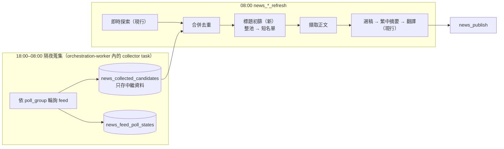

# 隔夜新聞蒐集與標題初篩規劃

狀態：規劃，尚未實作。本文件取代未合併分支 `fix/news-generation`（2026-09-16）的
同名規格；該分支建立在統一編排（#85）之前的 legacy 新聞流程上，不直接合併，只沿用
其中已驗證的設計概念（見[與舊分支的關係](#與舊分支的關係)）。

## 1. 問題與證據

目前新聞只在 08:00 由 `news_*_refresh` 讀一次 feed（`discover_feed_candidates`，
時間窗口為前 24 小時）。送進 AI 的新聞偏少有兩個獨立原因：

**原因一：feed 只列最新 N 則，前一晚的稿件到 08:00 已被擠出。** 2026-09-30 本機
08:00 快照中，各來源實際能回溯到的最舊時間：

| 來源         | 則數 | 最舊（台北） | 漏掉的時段       |
| ------------ | ---- | ------------ | ---------------- |
| 經濟日報     | 20   | 09-30 00:18  | 前晚 18:00–00:18 |
| 中央社       | 10   | 09-29 21:53  | 前晚 18:00–21:53 |
| FXStreet     | 20   | 09-30 00:11  | 前晚 18:00–00:11 |
| City A.M.    | 10   | 09-29 23:46  | 前晚 18:00–23:46 |
| PR Newswire  | 10   | 09-30 05:30  | 前晚 18:00–05:30 |
| TheStreet    | 10   | 09-30 05:37  | 前晚 18:00–05:37 |
| 鉅亨（美股） | 20   | 09-30 03:20  | 前晚 18:00–03:20 |

**原因二：擷取與選題的上限。** 每版探索到 100–146 則，但依 `EditionSpec` 只擷取
80／100 則、擷取後保留 40／60 則（全球／台美股），每次選題最多送 20／30 則。
排序只靠 `headline_impact_patterns` 正則與發布時間，不是 AI 判斷。

因此只增加蒐集量不會讓 AI 看到更多新聞；必須同時讓 AI 在 08:00 以低成本看過整個
候選池，再把最值得深入處理的稿件送進既有選題流程。

## 2. 定案決策（2026-09-30）

| 項目     | 決策                                                                                                  |
| -------- | ----------------------------------------------------------------------------------------------------- |
| 蒐集時段 | 每日 18:00 至隔日 08:00（Asia/Taipei，含週末）持續輪詢 feed                                           |
| 時間資格 | 維持現行「refresh 執行時間往前 24 小時」；18:00 首輪輪詢自然涵蓋台股 13:30 收盤後的盤後、法人與財報稿 |
| AI 擴容  | 08:00 新增「標題初篩」階段：模型先看過整晚全部標題，挑出短名單後才擷取正文並進入既有選題、摘要、翻譯  |
| 上線方式 | 功能旗標直接上線，不做 shadow 預覽；出問題關閉旗標即回到現行 08:00 單次探索                           |
| 正文     | 維持「文章正文不落地」；蒐集只存中繼資料，08:00 入選後才擷取正文                                      |

非目標：不改變發布時間（仍為 08:00 routine、10:00 自動 attempt 截止）、不改星等配額與
選題政策、不新增內容分類（舊規格的 `content_type`）、不新增客戶端 UI。

## 3. 流程

模型階段順序由 `選稿 → 繁中摘要 → 翻譯` 變為 `標題初篩 → 擷取 → 選稿 → 繁中摘要 → 翻譯`，
各階段仍嚴格串行。

## 4. 隔夜蒐集

### 4.1 執行位置

蒐集以獨立的 asyncio task 跑在 `orchestration-worker` 程序內，不新增 Compose 服務：

- 維持部署契約「只有統一 dispatcher／worker 拓撲」，不需修改契約腳本與停機順序。
- worker 已具備新聞設定、來源憑證與對外連線；dispatcher 刻意只有資料庫權限，不適合。
- 正式環境只有一個 worker，collector 與 08:00 正文擷取可共用程序內的同主機請求間隔。
- 以 PostgreSQL advisory lock 確保多個 worker 時只有一個 collector 在跑。
- collector 例外只記錄事件並以退避重啟 task，不得讓 worker 主迴圈中斷。

不採用「每次輪詢建立一個 JobRun」：一晚約 330 次輪詢會淹沒 `job_runs` 與後台頁面，
輪詢狀態改由專用資料表記錄。

### 4.2 輪詢排程

| `poll_group` | feed 數 | 間隔   | 一晚約略請求數 |
| ------------ | ------- | ------ | -------------- |
| `flash`      | 2       | 1 小時 | 28             |
| `fast`       | 13      | 1 小時 | 182            |
| `normal`     | 17      | 2 小時 | 119            |

- 18:00 首輪全部來源，07:40 最後一輪全部來源；07:55 後不再開始新輪詢。
- 每個來源依 feed URL 雜湊取得固定 0–10 分鐘偏移，避免整點同時發出請求。
- 重啟後只補最近一期到期的輪詢，不重放漏掉的全部輪次。
- 間隔以 `FeedSource` 新增的選填欄位 `poll_interval_minutes` 覆寫；`poll_group`
  預設值寫在程式內，不新增環境變數。依第 1 節資料，PR Newswire、TheStreet 等
  10 則 feed 若出現缺口，優先縮短該來源間隔。
- 沿用現有 `robots_allowed`、`min_interval_seconds`、SSRF 安全 client、語言過濾、
  `link_pattern` 與白名單；讀取 `news_dependency_states` 的來源冷卻，429／5xx 以
  5／15／30 分鐘退避並遵守 `Retry-After`。
- 蒐集保存整個有界回應中的全部合格項目，不套用即時探索的 `max_items` 上限。
- 支援 `ETag`／`Last-Modified` 條件式請求；304 視為成功輪詢。

### 4.3 缺口偵測

每次輪詢比對「本次回應最舊一則的發布時間」與「上次成功輪詢時間」。若最舊一則
晚於上次成功輪詢，代表兩次輪詢之間可能有稿件被擠出，發 `news.collection.gap`
（`hostname`、`feed`、`gap_minutes`）。這是調整輪詢間隔的主要依據，不自動調整。

### 4.4 資料表

| 資料表                      | 欄位                                                                                                                                                                | 保留 |
| --------------------------- | ------------------------------------------------------------------------------------------------------------------------------------------------------------------- | ---- |
| `news_collected_candidates` | `candidate_id`（PK，沿用 URL SHA-256）、`url`、`hostname`、`source_name`、`headline`、`seen_at`、`markets`、`source_key`、`first_collected_at`、`last_collected_at` | 7 天 |
| `news_feed_poll_states`     | `source_key`（PK）、`feed_url`、`last_attempt_at`、`last_success_at`、`last_status`、`last_count`、`last_error_code`、`etag`、`last_modified`、`cooldown_until`     | 常駐 |

- 相同 URL 再次出現只更新 `last_collected_at` 與市場標記，不覆寫首次的 `seen_at`，
  避免舊稿以新時間重新取得資格。
- 不保存正文、摘要或 feed 內文；過期列由 collector 每輪清理，關閉旗標時清理仍執行。

## 5. 08:00 整合

在 `modules/orchestration/news_functions.py` 的 refresh 中，`discover_feed_candidates`
之後：

1. 讀取 `news_collected_candidates` 中標記給本市場、`seen_at`（無日期時用
   `first_collected_at`）落在 `[refresh 執行時間 − 24h, refresh 執行時間]` 的候選。
2. 與即時探索結果以 candidate ID 合併去重；即時探索帶回的正文（`provides_full_text`）
   優先保留。
3. `news_candidates` 新增 `discovered_via`（`live`／`collected`／`both`），後台可看出
   哪些候選是靠隔夜蒐集救回的。
4. 合併後的候選池進入第 6 節的標題初篩；初篩旗標關閉時沿用現行 `_cap_discovery`。

重試與續跑：蒐集在 08:00 前停止，候選池讀取結果穩定；即時探索仍沿用 feed checkpoint。
合併結果納入 `input_digest`，因此候選池變動會正確產生新 revision。

只存在於蒐集池、來自全文 feed（TheStreet、City A.M.、INSIDE、Guardian）的稿件沒有
feed 內文，會改走文章頁擷取。PR1 試跑期間須確認這些主機的文章頁能否擷取；若大量
`fetch_failed`，再另案評估舊規格的 24 小時全文暫存（需修改「正文不落地」原則）。

## 6. 標題初篩

### 6.1 輸入與輸出

- 輸入：合併後候選池的每則標題、來源名稱、發布時間，以短序號代替 64 字元 ID 以節省
  token（約 35 token／則）；附上本版 `MARKET_FOCUS` 相關性門檻與重要性尺度摘要。
- 輸出：嚴格 JSON，依重要性排序的序號清單與 1–5 粗略分數；未列出者即未入選。
- 短名單上限：全球 60、台股與美股 90（既有擷取後保留量 40／60 的 1.5 倍，吸收擷取
  失敗）。短名單低於現行擷取上限 80／100，正文擷取請求量不增反減。

### 6.2 批次與成本

- 每次呼叫最多 200 則標題（約 7k token），每市場最多兩次呼叫；第二次附上第一次已選
  標題以利去重。
- 候選池超過 400 則時，先以現行 `_market_impact_score` 與發布時間排序截斷，並發
  `news.screen.truncated`（含截斷則數），不得靜默截斷。
- 預估每市場每日增加 1–2 次短呼叫、約 30 秒延遲；選稿 prompt（約 28k token × 最多
  三次）不變，因此模型成本增幅有限。

### 6.3 與既有流程的銜接

- 擷取後的 `_limit_candidates` 在初篩啟用時改以初篩名次排序，取代正則分數；
  `max_per_source` 來源上限維持不變。
- 選稿仍為最多三次呼叫（兩個整池視窗加一次備選），初篩呼叫不計入此額度。
- 新增 `modules/news/prompts/screen_criteria.txt`，`prompt_version` 為
  `screen-v1:<準則摘要>`，並納入 `input_digest`。
- `news_generation_audits` 新增 stage `screen`；結果保存在
  `FunctionRun.result._news_model_attempts`，續跑直接重用，不重新取得修正額度。
- `news_candidates` 新增 `screen_rank`、`screen_score` 與 stage `screened_out`
  （初篩未入選），後台候選列表可排序檢視。

### 6.4 失敗處理

| 情況                                               | 處理                                                                              |
| -------------------------------------------------- | --------------------------------------------------------------------------------- |
| JSON／schema 驗證失敗                              | 同一輸入修正一次；仍失敗則退回現行正則排序，發 `news.screen.fallback`，不阻擋版本 |
| 回傳未知序號                                       | 丟棄該序號並記錄；有效序號照常使用                                                |
| provider timeout、429、5xx、認證、資料庫或未知錯誤 | 沿用既有系統性錯誤政策：停止後續模型呼叫、依分類重試                              |

## 7. 設定與部署

| 變數                                          | 預設    | 用途                                           |
| --------------------------------------------- | ------- | ---------------------------------------------- |
| `DAILY_INSIGHTS_NEWS_COLLECTION_ENABLED`      | `false` | 啟用隔夜蒐集，並讓 08:00 refresh 合併蒐集池    |
| `DAILY_INSIGHTS_NEWS_HEADLINE_SCREEN_ENABLED` | `false` | 啟用標題初篩；關閉時沿用正則排序與現行擷取上限 |

- 兩個旗標獨立，可分別回退；`DAILY_INSIGHTS_DAILY_NEWS_ENABLED` 為 `false` 時兩者都
  不發出外部請求。
- `release.yml` 傳遞兩個 GitHub Variables；`scripts/production/deploy.sh` 驗證值只能
  是 `true`／`false`；`compose.yaml`、`compose.production.yaml` 傳給 worker（API 只需
  讀取狀態，不需旗標）。
- 新增 Alembic migration：兩張新表、`news_candidates` 三個新欄位與新 stage 值。

## 8. 後台

在既有「新聞管理」頁擴充，不新增頁面：

- 每個市場版本顯示「隔夜蒐集／08:00 即時／兩者」候選數，以及初篩入選數。
- 候選列表加上 `discovered_via` 標記與初篩名次、`screened_out` 階段篩選。
- 新增來源輪詢狀態區塊：最後成功時間、最近則數、錯誤碼、冷卻、今晚缺口次數。
  標示為「目前狀態」，不當成歷史每日統計。
- 遵守 Dashboard UI 規則：初次載入 skeleton（`role="status"`）、三語系 i18n key、
  Tailwind utilities 與既有 design tokens；更新 OpenAPI 與 `@daily-insights/api-client`。

## 9. 分階段交付

| PR  | 內容                                                                                      | 上線後觀察                                                        |
| --- | ----------------------------------------------------------------------------------------- | ----------------------------------------------------------------- |
| 1   | migration、collector task、輪詢狀態、缺口事件、清理、`COLLECTION_ENABLED`（只蒐集不使用） | 連續 2–3 晚：各市場蒐集量、缺口來源、全文 feed 主機文章頁可否擷取 |
| 2   | refresh 合併蒐集池、`discovered_via`、後台候選標記                                        | 入選新聞中 18:00–02:00 發布的比例，是否增加且無重複事件           |
| 3   | 標題初篩階段、prompt 檔、`HEADLINE_SCREEN_ENABLED`、失敗退回                              | 初篩 fallback 率、08:00→發布耗時、token 成本、人工抽查短名單品質  |
| 4   | 後台來源輪詢狀態區塊、`daily-news.md` 與 `news-recovery.md` 更新                          | —                                                                 |

PR1 讓旗標在正式環境先蒐集但不影響發布，用實際資料校正輪詢間隔與初篩上限，再開啟
PR2／PR3 的行為。

## 10. 驗證

- 單元測試：跨午夜的蒐集日期與時段、偏移與到期判斷、重啟只補最近一期、07:55 後
  不開新輪詢、相同 URL 不覆寫 `seen_at`、304 處理、冷卻與退避、缺口偵測。
- 合併：去重、全文優先、24 小時資格、無日期候選以 `first_collected_at` 判斷、
  `input_digest` 隨候選池變動。
- 初篩：schema 驗證與修正一次、未知序號、fallback、超過 400 則截斷事件、checkpoint
  重用、`screened_out` 寫入。
- 整合測試使用拋棄式 PostgreSQL：migration 升降版往返、collector advisory lock、
  refresh 端到端（mock feed 與 mock 模型）。
- 全套 `format:check`、`lint:check`、`type:check`、`api-client:check`、`test`、`build`。

成功判準（PR3 上線後一週）：各市場進入初篩的候選池高於現行 100–146 則；已發布新聞
中有前一晚被擠出 feed 的稿件；初篩 fallback 率低於 5%；10:00 前完成率不低於現行。

## 與舊分支的關係

`fix/news-generation` 的 8f7e7ef、8c845ea 已實作一版隔夜蒐集，但：

- 整合點是 legacy `modules/news/service.py`，而正式流程已改為
  `modules/orchestration/news_functions.py`，無法直接合併。
- 採用 shadow 預覽、PostgreSQL 請求閘門、24 小時全文暫存、嚴格 18:00–08:00 資格、
  內容分類與 09:00 截止，與本次決策不同。

可沿用：蒐集日期與偏移計算（`collection_date`、`due_slot`）、輪詢狀態欄位設計、
條件式請求處理，以及相關測試案例的情境。
